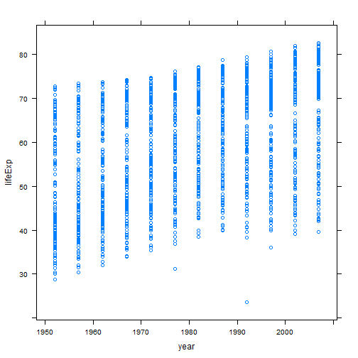

Data handling
========================================================

Some code to play with a data frame.


```r
gDat <- read.delim("gapminderDataFiveYear.txt")

gdURL <- "http://www.stat.ubc.ca/~jenny/notOcto/STAT545A/examples/gapminder/data/gapminderDataFiveYear.txt"
gDat <- read.delim(file = gdURL)

str(gDat)
```

```
## 'data.frame':	1704 obs. of  6 variables:
##  $ country  : Factor w/ 142 levels "Afghanistan",..: 1 1 1 1 1 1 1 1 1 1 ...
##  $ year     : int  1952 1957 1962 1967 1972 1977 1982 1987 1992 1997 ...
##  $ pop      : num  8425333 9240934 10267083 11537966 13079460 ...
##  $ continent: Factor w/ 5 levels "Africa","Americas",..: 3 3 3 3 3 3 3 3 3 3 ...
##  $ lifeExp  : num  28.8 30.3 32 34 36.1 ...
##  $ gdpPercap: num  779 821 853 836 740 ...
```

```r
head(gDat)
```

```
##       country year      pop continent lifeExp gdpPercap
## 1 Afghanistan 1952  8425333      Asia   28.80     779.4
## 2 Afghanistan 1957  9240934      Asia   30.33     820.9
## 3 Afghanistan 1962 10267083      Asia   32.00     853.1
## 4 Afghanistan 1967 11537966      Asia   34.02     836.2
## 5 Afghanistan 1972 13079460      Asia   36.09     740.0
## 6 Afghanistan 1977 14880372      Asia   38.44     786.1
```

```r
tail(gDat)
```

```
##       country year      pop continent lifeExp gdpPercap
## 1699 Zimbabwe 1982  7636524    Africa   60.36     788.9
## 1700 Zimbabwe 1987  9216418    Africa   62.35     706.2
## 1701 Zimbabwe 1992 10704340    Africa   60.38     693.4
## 1702 Zimbabwe 1997 11404948    Africa   46.81     792.4
## 1703 Zimbabwe 2002 11926563    Africa   39.99     672.0
## 1704 Zimbabwe 2007 12311143    Africa   43.49     469.7
```

```r

names(gDat)
```

```
## [1] "country"   "year"      "pop"       "continent" "lifeExp"   "gdpPercap"
```

```r
colnames(gDat)
```

```
## [1] "country"   "year"      "pop"       "continent" "lifeExp"   "gdpPercap"
```

```r
length(gDat)
```

```
## [1] 6
```

```r
ncol(gDat)
```

```
## [1] 6
```

```r

head(rownames(gDat))
```

```
## [1] "1" "2" "3" "4" "5" "6"
```

```r
dim(gDat)
```

```
## [1] 1704    6
```

```r
nrow(gDat)
```

```
## [1] 1704
```

```r

summary(gDat)
```

```
##         country          year           pop              continent  
##  Afghanistan:  12   Min.   :1952   Min.   :6.00e+04   Africa  :624  
##  Albania    :  12   1st Qu.:1966   1st Qu.:2.79e+06   Americas:300  
##  Algeria    :  12   Median :1980   Median :7.02e+06   Asia    :396  
##  Angola     :  12   Mean   :1980   Mean   :2.96e+07   Europe  :360  
##  Argentina  :  12   3rd Qu.:1993   3rd Qu.:1.96e+07   Oceania : 24  
##  Australia  :  12   Max.   :2007   Max.   :1.32e+09                 
##  (Other)    :1632                                                   
##     lifeExp       gdpPercap     
##  Min.   :23.6   Min.   :   241  
##  1st Qu.:48.2   1st Qu.:  1202  
##  Median :60.7   Median :  3532  
##  Mean   :59.5   Mean   :  7215  
##  3rd Qu.:70.8   3rd Qu.:  9325  
##  Max.   :82.6   Max.   :113523  
## 
```

```r

library(lattice)
xyplot(lifeExp ~ year, data = gDat)
```

 

```r
xyplot(lifeExp ~ gdpPercap, gDat)
```

 

```r
xyplot(lifeExp ~ gdpPercap, gDat, subset = country == "Colombia")
```

 

```r
xyplot(lifeExp ~ gdpPercap, gDat, subset = country == "Colombia", type = c("p", 
    "r"))
```

 

```r
xyplot(lifeExp ~ gdpPercap | continent, gDat, subset = year == 2007)
```

 

```r
xyplot(lifeExp ~ gdpPercap, gDat, group = continent, subset = year == 2007, 
    auto.key = TRUE)
```

 

```r

xyplot(lifeExp ~ year, gDat, subset = country == "Canada")
```

 

```r
xyplot(gdpPercap ~ year, gDat, subset = country == "Canada")
```

 

```r

head(gDat$lifeExp)
```

```
## [1] 28.80 30.33 32.00 34.02 36.09 38.44
```

```r
summary(gDat$lifeExp)
```

```
##    Min. 1st Qu.  Median    Mean 3rd Qu.    Max. 
##    23.6    48.2    60.7    59.5    70.8    82.6
```

```r
densityplot(~lifeExp, gDat)
```

 

```r
densityplot(~lifeExp | year, gDat)
```

 

```r

summary(gDat$year)
```

```
##    Min. 1st Qu.  Median    Mean 3rd Qu.    Max. 
##    1950    1970    1980    1980    1990    2010
```

```r
table(gDat$year)
```

```
## 
## 1952 1957 1962 1967 1972 1977 1982 1987 1992 1997 2002 2007 
##  142  142  142  142  142  142  142  142  142  142  142  142
```

```r

class(gDat$continent)
```

```
## [1] "factor"
```

```r
summary(gDat$continent)
```

```
##   Africa Americas     Asia   Europe  Oceania 
##      624      300      396      360       24
```

```r
table(gDat$continent)
```

```
## 
##   Africa Americas     Asia   Europe  Oceania 
##      624      300      396      360       24
```

```r
levels(gDat$continent)
```

```
## [1] "Africa"   "Americas" "Asia"     "Europe"   "Oceania"
```

```r
nlevels(gDat$continent)
```

```
## [1] 5
```

```r
barchart(table(gDat$continent), horizontal = FALSE)
```

 

```r
dotplot(table(gDat$continent), type = "h", col.line = NA)
```

 

```r
dotplot(table(gDat$continent), type = c("p", "h"), col.line = NA)
```

 

```r
str(gDat$continent)
```

```
##  Factor w/ 5 levels "Africa","Americas",..: 3 3 3 3 3 3 3 3 3 3 ...
```

```r

(uruguay.dat <- subset(gDat, subset = country == "Uruguay"))
```

```
##      country year     pop continent lifeExp gdpPercap
## 1621 Uruguay 1952 2252965  Americas   66.07      5717
## 1622 Uruguay 1957 2424959  Americas   67.04      6151
## 1623 Uruguay 1962 2598466  Americas   68.25      5603
## 1624 Uruguay 1967 2748579  Americas   68.47      5445
## 1625 Uruguay 1972 2829526  Americas   68.67      5703
## 1626 Uruguay 1977 2873520  Americas   69.48      6504
## 1627 Uruguay 1982 2953997  Americas   70.81      6920
## 1628 Uruguay 1987 3045153  Americas   71.92      7452
## 1629 Uruguay 1992 3149262  Americas   72.75      8137
## 1630 Uruguay 1997 3262838  Americas   74.22      9230
## 1631 Uruguay 2002 3363085  Americas   75.31      7727
## 1632 Uruguay 2007 3447496  Americas   76.38     10611
```

```r
gDat[1621:1632, ]
```

```
##      country year     pop continent lifeExp gdpPercap
## 1621 Uruguay 1952 2252965  Americas   66.07      5717
## 1622 Uruguay 1957 2424959  Americas   67.04      6151
## 1623 Uruguay 1962 2598466  Americas   68.25      5603
## 1624 Uruguay 1967 2748579  Americas   68.47      5445
## 1625 Uruguay 1972 2829526  Americas   68.67      5703
## 1626 Uruguay 1977 2873520  Americas   69.48      6504
## 1627 Uruguay 1982 2953997  Americas   70.81      6920
## 1628 Uruguay 1987 3045153  Americas   71.92      7452
## 1629 Uruguay 1992 3149262  Americas   72.75      8137
## 1630 Uruguay 1997 3262838  Americas   74.22      9230
## 1631 Uruguay 2002 3363085  Americas   75.31      7727
## 1632 Uruguay 2007 3447496  Americas   76.38     10611
```

```r

subset(gDat, subset = country == "Mexico", select = c(country, year, lifeExp))
```

```
##     country year lifeExp
## 985  Mexico 1952   50.79
## 986  Mexico 1957   55.19
## 987  Mexico 1962   58.30
## 988  Mexico 1967   60.11
## 989  Mexico 1972   62.36
## 990  Mexico 1977   65.03
## 991  Mexico 1982   67.41
## 992  Mexico 1987   69.50
## 993  Mexico 1992   71.45
## 994  Mexico 1997   73.67
## 995  Mexico 2002   74.90
## 996  Mexico 2007   76.19
```

```r
subset(gDat, subset = country == "Mexico", select = c("country", "year", "lifeExp"))
```

```
##     country year lifeExp
## 985  Mexico 1952   50.79
## 986  Mexico 1957   55.19
## 987  Mexico 1962   58.30
## 988  Mexico 1967   60.11
## 989  Mexico 1972   62.36
## 990  Mexico 1977   65.03
## 991  Mexico 1982   67.41
## 992  Mexico 1987   69.50
## 993  Mexico 1992   71.45
## 994  Mexico 1997   73.67
## 995  Mexico 2002   74.90
## 996  Mexico 2007   76.19
```

```r

(minYear <- min(gDat$year))
```

```
## [1] 1952
```

```r
myFit <- lm(lifeExp ~ I(year - minYear), gDat, subset = country == "Colombia")
summary(myFit)
```

```
## 
## Call:
## lm(formula = lifeExp ~ I(year - minYear), data = gDat, subset = country == 
##     "Colombia")
## 
## Residuals:
##    Min     1Q Median     3Q    Max 
## -2.784 -0.382  0.184  0.841  1.803 
## 
## Coefficients:
##                   Estimate Std. Error t value Pr(>|t|)    
## (Intercept)        53.4271     0.7122    75.0  4.3e-15 ***
## I(year - minYear)   0.3808     0.0219    17.4  8.5e-09 ***
## ---
## Signif. codes:  0 '***' 0.001 '**' 0.01 '*' 0.05 '.' 0.1 ' ' 1
## 
## Residual standard error: 1.31 on 10 degrees of freedom
## Multiple R-squared:  0.968,	Adjusted R-squared:  0.965 
## F-statistic:  301 on 1 and 10 DF,  p-value: 8.54e-09
```

```r

with(subset(gDat, subset = country == "Colombia"), cor(lifeExp, gdpPercap))
```

```
## [1] 0.9515
```

