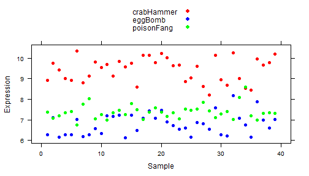

Seminar 1 -- Data exploration
========================================================

Exploring a small gene expression dataset (39 samples, 3 genes).

First, read in the data:

```r
prDat <- read.table("GSE4051_MINI.txt", header = TRUE, row.names = 1)
str(prDat)
```

```
## 'data.frame':	39 obs. of  6 variables:
##  $ sample    : int  20 21 22 23 16 17 6 24 25 26 ...
##  $ devStage  : Factor w/ 5 levels "4_weeks","E16",..: 2 2 2 2 2 2 2 4 4 4 ...
##  $ gType     : Factor w/ 2 levels "NrlKO","wt": 2 2 2 2 1 1 1 2 2 2 ...
##  $ crabHammer: num  10.22 10.02 9.64 9.65 8.58 ...
##  $ eggBomb   : num  7.46 6.89 6.72 6.53 6.47 ...
##  $ poisonFang: num  7.37 7.18 7.35 7.04 7.49 ...
```


Next, explore the sample breakdown:

```r
table(prDat[, c("devStage", "gType")])
```

```
##          gType
## devStage  NrlKO wt
##   4_weeks     4  4
##   E16         3  4
##   P10         4  4
##   P2          4  4
##   P6          4  4
```


Now observe the trends in expression for these samples/genes:

```r
library(lattice)
col.scheme <- c("red", "blue", "green")
xyplot(crabHammer + eggBomb + poisonFang ~ sample, data = prDat, col = col.scheme, 
    pch = 19, xlab = "Sample", ylab = "Expression", key = list(space = "top", 
        text = list(c("crabHammer", "eggBomb", "poisonFang")), points = list(col = col.scheme, 
            pch = 19)))
```

 


