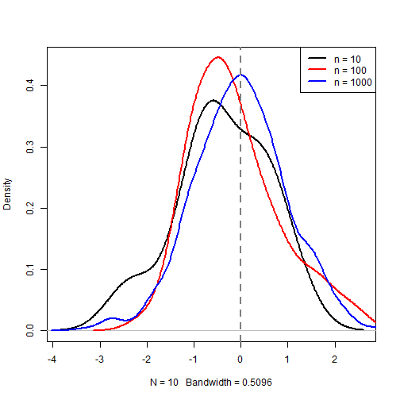
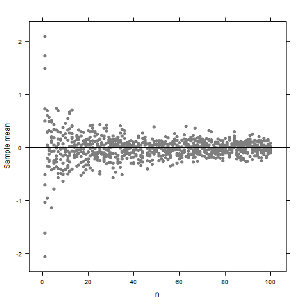

Distributions and Simulations
========================================================

Some code to experiment with probability distributions and simulated data.

First, plot some randomly generated data with default mean/sd values. I want to compare the distributions I get when using different values of n.

```r
set.seed(1234)
d1 <- density(rnorm(10))
d2 <- density(rnorm(100))
d3 <- density(rnorm(1000))
plot(d1, lwd = 2, ylim = c(0, max(c(d1$y, d2$y, d3$y))), main = "")
lines(d2, col = "red", lwd = 2)
lines(d3, col = "blue", lwd = 2)
abline(v = 0, col = "grey50", lty = 2, lwd = 2)
legend(x = "topright", legend = c("n = 10", "n = 100", "n = 1000"), col = c("black", 
    "red", "blue"), lty = 1, lwd = 2)
```

 


Now I'm interested in knowing how the sample mean changes as sample size is increased. I'll try generating data using different n-values and see how the sample mean changes around 0.

```r
set.seed(540)
myMean <- 0
nVals <- rep(seq(1:100), each = 10)
sampleMeans <- sapply(nVals, function(n) mean(rnorm(n, mean = myMean)))
meanData <- data.frame(nVal = nVals, sampleMean = sampleMeans)

library(lattice)
xyplot(sampleMean ~ nVal, data = meanData, panel = function(x, y) {
    panel.xyplot(x, y, pch = 19, col = "grey50")
    panel.abline(h = 0)
}, xlab = "n", ylab = "Sample mean")
```

 


Experiment with the CDF normal function:

```r
set.seed(321)
x <- rnorm(5000)

thresh <- 0.9
(realProbLess <- pnorm(thresh))
```

```
## [1] 0.8159
```

```r
(obsProbLess <- mean(x <= thresh))
```

```
## [1] 0.8086
```

```r

(realProbGreater <- pnorm(thresh, lower.tail = FALSE))
```

```
## [1] 0.1841
```

```r
(obsProbGreater <- mean(x > thresh))
```

```
## [1] 0.1914
```

```r

threshMin <- 0.9
threshMax <- 1.1
(realProbInt <- pnorm(threshMax) - pnorm(threshMin))
```

```
## [1] 0.04839
```

```r
(obsProbInt <- mean(x > threshMin & x <= threshMax))
```

```
## [1] 0.053
```


Play around with the Poisson distribution:

```r
x <- rpois(5000, lambda = 1)

thresh <- 1
(realProbLess <- ppois(thresh, lambda = 1))
```

```
## [1] 0.7358
```

```r
(obsProbLess <- mean(x <= thresh))
```

```
## [1] 0.7432
```

