Lattice plotting
========================================================

Going through various examples of lattice plots.
First load the data:

```r
library(lattice)
kDat <- readRDS("GSE4051_MINI.rds")
table(kDat[, c("devStage", "gType")])
```

```
##          gType
## devStage  wt NrlKO
##   E16      4     3
##   P2       4     4
##   P6       4     4
##   P10      4     4
##   4_weeks  4     4
```


Scatterplots
------------
Basic scatterplots using defaults:

```r
xyplot(eggBomb ~ crabHammer, data = kDat)
```

 

```r
xyplot(poisonFang ~ crabHammer, data = kDat)
```

 


Plotting multiple datasets on the y-axis:

```r
xyplot(eggBomb + poisonFang ~ crabHammer, data = kDat, auto.key = TRUE)
```

 


Plotting side-by-side scatterplots:

```r
xyplot(eggBomb + poisonFang ~ crabHammer, kDat, outer = TRUE, grid = TRUE)
```

 


Using the 'groups' argument to colour points by gType:

```r
xyplot(eggBomb + poisonFang ~ crabHammer, kDat, outer = TRUE, grid = TRUE, groups = gType, 
    auto.key = TRUE)
```

 


Reshaping the data to use factors for different panels:

```r
nDat <- with(kDat, data.frame(sidChar, sidNum, devStage, gType, crabHammer, 
    probeset = factor(rep(c("eggBomb", "poisonFang"), each = nrow(kDat))), geneExp = c(eggBomb, 
        poisonFang)))
str(nDat)
```

```
## 'data.frame':	78 obs. of  7 variables:
##  $ sidChar   : Factor w/ 39 levels "Sample_1","Sample_10",..: 13 14 15 16 8 9 36 17 18 19 ...
##  $ sidNum    : num  20 21 22 23 16 17 6 24 25 26 ...
##  $ devStage  : Factor w/ 5 levels "E16","P2","P6",..: 1 1 1 1 1 1 1 2 2 2 ...
##  $ gType     : Factor w/ 2 levels "wt","NrlKO": 1 1 1 1 2 2 2 1 1 1 ...
##  $ crabHammer: num  10.22 10.02 9.64 9.65 8.58 ...
##  $ probeset  : Factor w/ 2 levels "eggBomb","poisonFang": 1 1 1 1 1 1 1 1 1 1 ...
##  $ geneExp   : num  7.46 6.89 6.72 6.53 6.47 ...
```

```r
xyplot(geneExp ~ crabHammer | probeset, nDat, grid = TRUE, groups = gType, auto.key = TRUE)
```

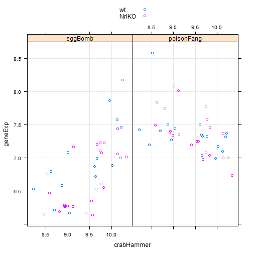 


Now try showing developmental stage using the groups argument:

```r
xyplot(geneExp ~ crabHammer | probeset, nDat, grid = TRUE, groups = devStage, 
    auto.key = TRUE)
```

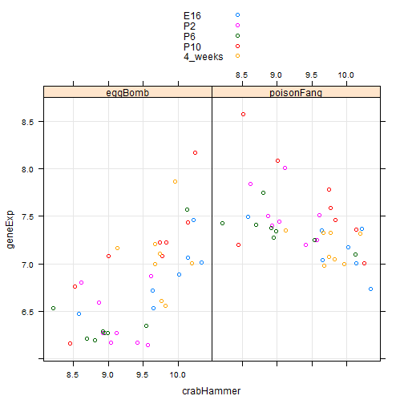 


Stripplots
----------
Now we treat all genes as factors:

```r
oDat <- with(kDat, data.frame(sidChar, sidNum, devStage, gType, probeset = factor(rep(c("crabHammer", 
    "eggBomb", "poisonFang"), each = nrow(kDat))), geneExp = c(crabHammer, eggBomb, 
    poisonFang)))
str(oDat)
```

```
## 'data.frame':	117 obs. of  6 variables:
##  $ sidChar : Factor w/ 39 levels "Sample_1","Sample_10",..: 13 14 15 16 8 9 36 17 18 19 ...
##  $ sidNum  : num  20 21 22 23 16 17 6 24 25 26 ...
##  $ devStage: Factor w/ 5 levels "E16","P2","P6",..: 1 1 1 1 1 1 1 2 2 2 ...
##  $ gType   : Factor w/ 2 levels "wt","NrlKO": 1 1 1 1 2 2 2 1 1 1 ...
##  $ probeset: Factor w/ 3 levels "crabHammer","eggBomb",..: 1 1 1 1 1 1 1 1 1 1 ...
##  $ geneExp : num  10.22 10.02 9.64 9.65 8.58 ...
```


Some basic stripplots:

```r
stripplot(~geneExp, oDat)
```

 

```r
stripplot(geneExp ~ probeset, oDat)
```

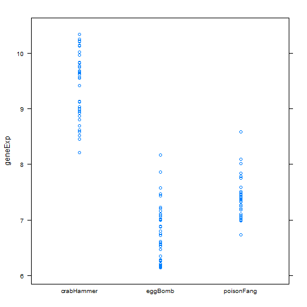 

```r
stripplot(geneExp ~ probeset, oDat, jitter.data = TRUE)
```

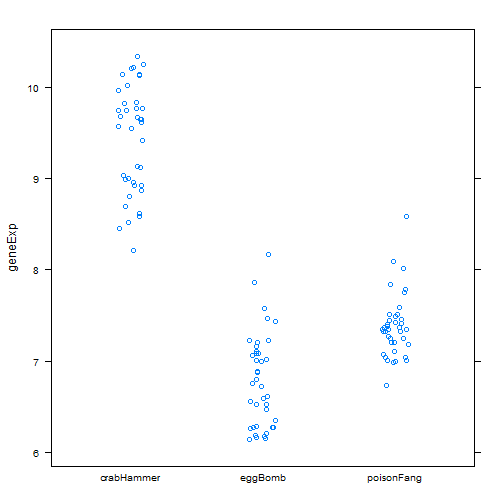 


Now try separating the plots into panels by probeset:

```r
stripplot(~geneExp | probeset, oDat, jitter.data = TRUE, grid = TRUE)
```

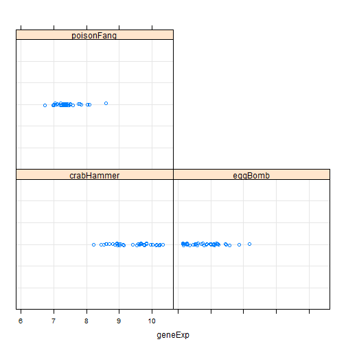 


Now consider expression at different developmental stages:

```r
stripplot(geneExp ~ devStage | probeset, oDat, layout = c(nlevels(oDat$probeset), 
    1), groups = gType, auto.key = TRUE, grid = TRUE, type = c("p", "a"))
```

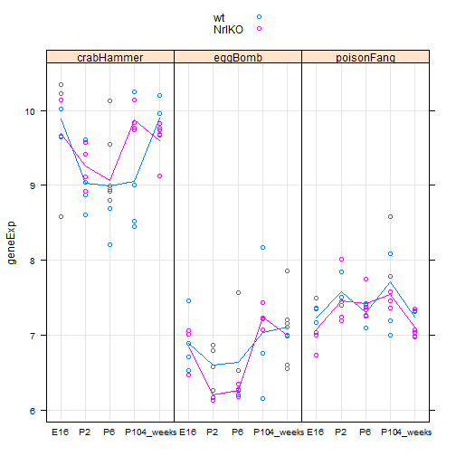 


Add some customizations to make it look a bit prettier, including a custom legend:

```r
stripplot(geneExp ~ devStage | probeset, oDat, layout = c(nlevels(oDat$probeset), 
    1), groups = gType, grid = TRUE, type = c("p", "a"), pch = 19, col = c("firebrick", 
    "dodgerblue"), key = list(space = "top", points = list(pch = 19, col = c("firebrick", 
    "dodgerblue")), text = list(levels(oDat$gType))), scales = list(x = list(rot = 90)))
```

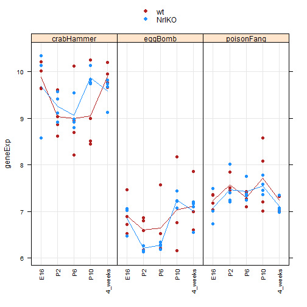 


Density plots
-------------
"A nice alternative to histograms". Start by looking at the distribution of gene expression values for different genotypes:

```r
densityplot(~geneExp | gType, oDat)
```

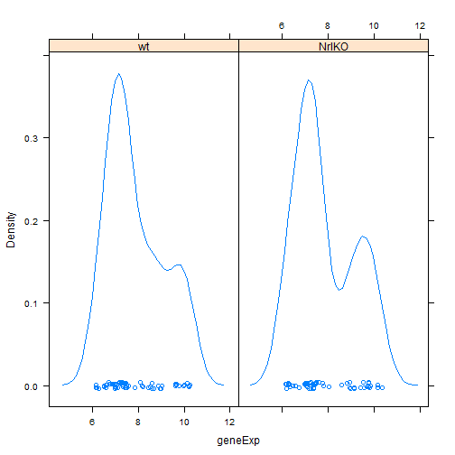 


Now observe the density by gene (one plot):

```r
myBw <- 0.2
myN <- 400
densityplot(~geneExp, oDat, groups = probeset, n = myN, bw = myBw, auto.key = TRUE)
```

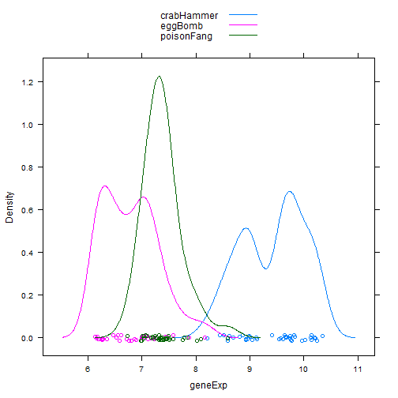 


Look at different developmental stages:

```r
densityplot(~geneExp, oDat, groups = devStage, auto.key = TRUE)
```

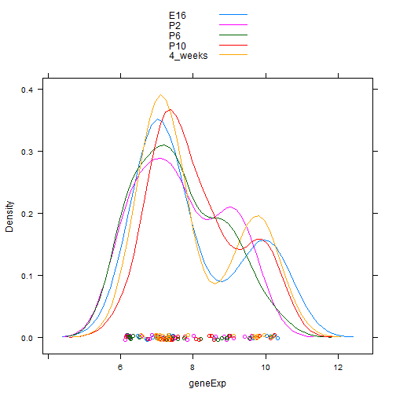 


Eek.. try doing the stages in different panels instead:

```r
densityplot(~geneExp | devStage, oDat, auto.key = TRUE)
```

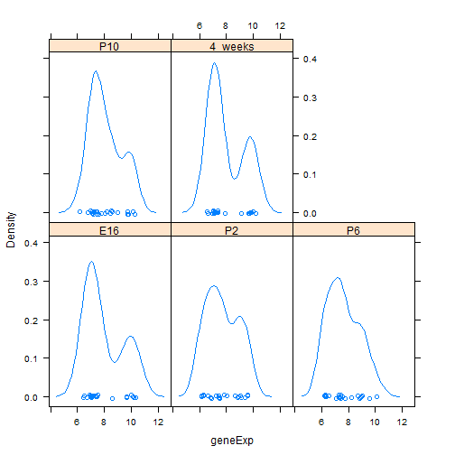 


Boxplots
--------
Box-and-whisker plots are an easy way to see distributions:

```r
bwplot(geneExp ~ devStage | gType, oDat)
```

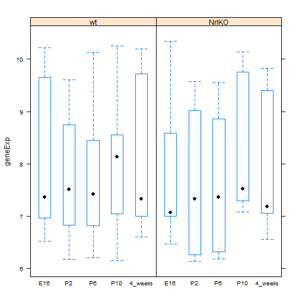 


Violin plots give more resolution about the density:

```r
bwplot(geneExp ~ devStage, oDat, panel = panel.violin, col = "darkgrey", border = "darkgrey")
```

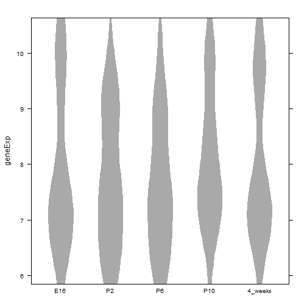 


Do a violin plot to compare between genes:

```r
bwplot(geneExp ~ probeset, oDat, panel = panel.violin, col = "darkgrey", border = "darkgrey")
```

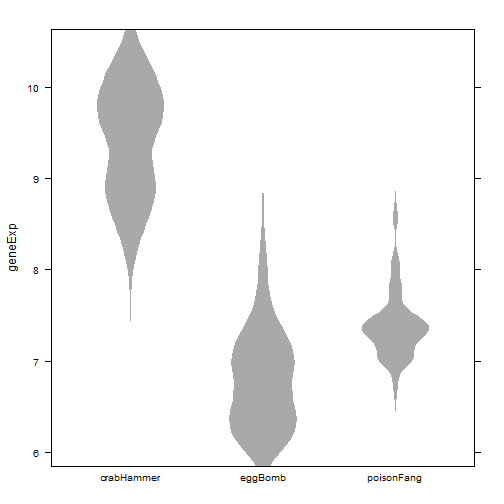 


Cool! But let's try separating them by genotype:

```r
bwplot(geneExp ~ probeset | gType, oDat, panel = panel.violin, col = "darkgrey", 
    border = "darkgrey")
```

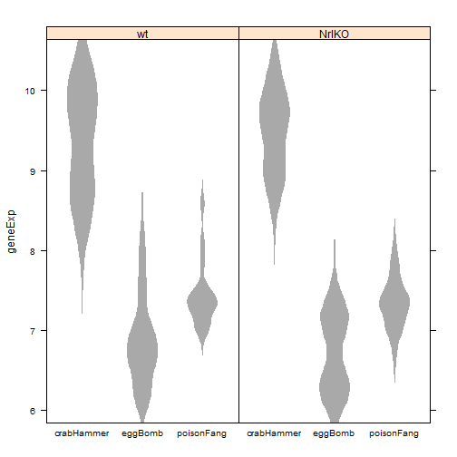 


Heatmaps
--------
Load in the full data set:

```r
prDat <- read.table("GSE4051_data.tsv")
str(prDat, max.level = 0)
```

```
## 'data.frame':	29949 obs. of  39 variables:
```

```r
prDes <- readRDS("GSE4051_design.rds")
str(prDes)
```

```
## 'data.frame':	39 obs. of  4 variables:
##  $ sidChar : chr  "Sample_20" "Sample_21" "Sample_22" "Sample_23" ...
##  $ sidNum  : num  20 21 22 23 16 17 6 24 25 26 ...
##  $ devStage: Factor w/ 5 levels "E16","P2","P6",..: 1 1 1 1 1 1 1 2 2 2 ...
##  $ gType   : Factor w/ 2 levels "wt","NrlKO": 1 1 1 1 2 2 2 1 1 1 ...
```


Draw 50 probesets at random to use for analysis:

```r
set.seed(540)
(myProbes <- sample(1:nrow(prDat), size = 50))
```

```
##  [1]  1594 25173 23016 10681 29403 11580 20714 12026 28704 25018   593
## [12]  2076  4509  1113 27902 25984  9164  1353  7242 10224 14861 10351
## [23] 16255  7377 23638 23646  1982 15743 10117 20706 20485  4740 12958
## [34]  4214 23230 18854 21953 18138 21512 23010  5985  6630  4337 17748
## [45] 11941  1869 18719 21974 23339  4977
```

```r
hDat <- prDat[myProbes, ]
```


Reshape for nicer heatmap results:

```r
hDat <- as.matrix(t(hDat))
rownames(hDat) <- with(prDes, paste(devStage, gType, sidChar, sep = "_"))
str(hDat)
```

```
##  num [1:39, 1:50] 7.38 7.21 7.3 7 6.95 ...
##  - attr(*, "dimnames")=List of 2
##   ..$ : chr [1:39] "E16_wt_Sample_20" "E16_wt_Sample_21" "E16_wt_Sample_22" "E16_wt_Sample_23" ...
##   ..$ : chr [1:50] "1417558_at" "1453147_at" "1450169_at" "1430577_at" ...
```


Set up a nice colour scheme, plot a simple heatmap:

```r
library(RColorBrewer)
colFun <- colorRampPalette(brewer.pal(n = 9, "Purples"))
heatmap(hDat, Rowv = NA, Colv = NA, scale = "none", margins = c(5, 8), col = colFun(256))
```

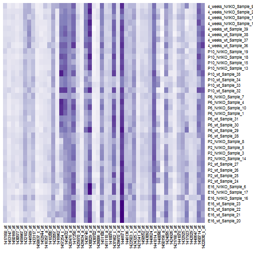 


Allow clustering by rows and columns:

```r
heatmap(hDat, scale = "none", margins = c(5, 8), col = colFun(256))
```

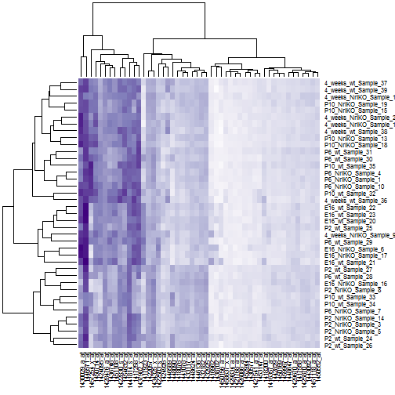 


Try a different heatmap function from the gplots lib:

```r
library(gplots)
```

```
## KernSmooth 2.23 loaded
## Copyright M. P. Wand 1997-2009
## 
## Attaching package: 'gplots'
## 
## The following object is masked from 'package:stats':
## 
##     lowess
```

```r
heatmap.2(hDat, col = colFun, trace = "none", margins = c(5, 9))
```

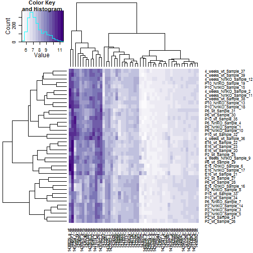 


Looks nice! And includes a default colour key which is helpful.

Finally, try a lattice heatmap:

```r
levelplot(t(hDat), col.regions = colFun(256), scales = list(x = list(rot = 90)), 
    xlab = NULL, ylab = NULL)
```

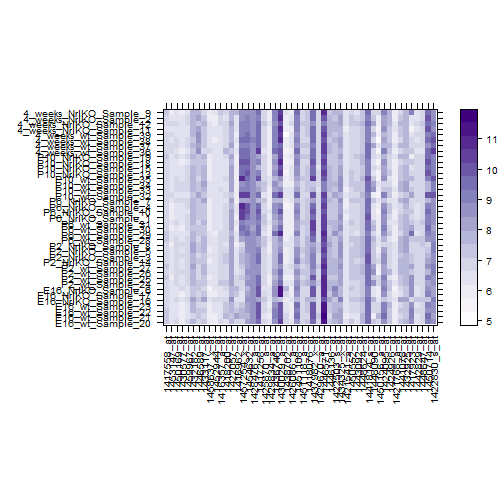 


Also very nice, and includes a colour key. Doesn't do clustering though!

Plot matrix
-----------
I will just play around with the lattice and hexbin versions.

First grab 4 samples to test with:

```r
set.seed(540)
(mySamples <- sample(1:ncol(prDat), size = 4))
```

```
## [1]  3 32 29 13
```

```r
pairDat <- subset(prDat, select = mySamples)
```


Try with lattice's splom function and their smooth scatter panel function:

```r
splom(pairDat, panel = panel.smoothScatter, raster = TRUE)
```

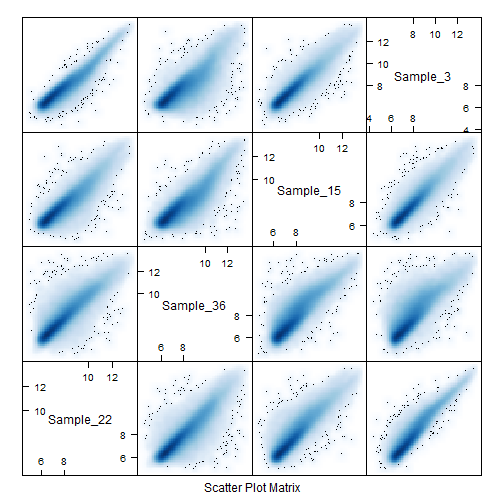 


Now use hexbin's function:

```r
library(hexbin)
```

```
## Loading required package: grid
```

```r
hexplom(pairDat)
```

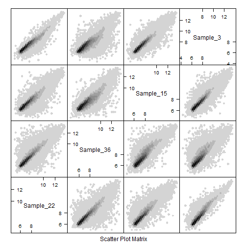 


Take-home
---------
Look for genes with differences in expression between genotypes. Select 5 genes at random for testing:

```r
set.seed(54045)
(myGenes <- sample(c(1:nrow(prDat)), size = 10))
```

```
##  [1] 25294  5225  7797 28727  9912  4836  3015 29207  7938  8732
```

```r
myDat <- prDat[myGenes, ]
```


Re-shape the data to be used for plotting:

```r
tDat <- data.frame(gExp = as.vector(unlist(t(myDat))), probeset = rep(rownames(myDat), 
    each = ncol(myDat)))
tDat <- suppressWarnings(data.frame(prDes, tDat))
str(tDat)
```

```
## 'data.frame':	390 obs. of  6 variables:
##  $ sidChar : chr  "Sample_20" "Sample_21" "Sample_22" "Sample_23" ...
##  $ sidNum  : num  20 21 22 23 16 17 6 24 25 26 ...
##  $ devStage: Factor w/ 5 levels "E16","P2","P6",..: 1 1 1 1 1 1 1 2 2 2 ...
##  $ gType   : Factor w/ 2 levels "wt","NrlKO": 1 1 1 1 2 2 2 1 1 1 ...
##  $ gExp    : num  8.17 7.75 8.09 7.85 8.82 ...
##  $ probeset: Factor w/ 10 levels "1419575_s_at",..: 8 8 8 8 8 8 8 8 8 8 ...
```


Now plot the expression for the 5 genes as a function of dev stage, separating the values by genotype:

```r
xyplot(gExp ~ devStage | probeset, tDat, groups = gType, type = c("p", "a"), 
    auto.key = TRUE, layout = c(5, 2), scales = list(x = list(rot = 90)))
```

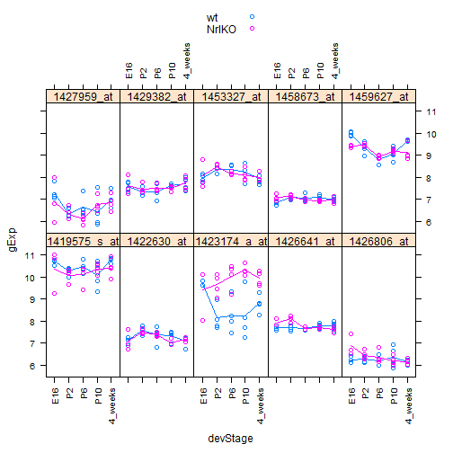 


Looks like the bottom middle gene, 1423174_a_at, shows higher expression in knockout vs. wild-type.

Try doing a simple violin plot by genotype to verify:

```r
bwplot(gExp ~ gType | probeset, tDat, panel = panel.violin, col = "darkgrey", 
    border = "darkgrey", layout = c(5, 2))
```

 


Indeed, it looks like it has higher expression in the knock-out samples.
