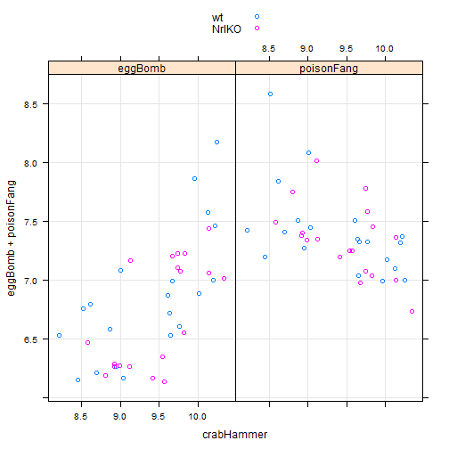

Lattice plotting
========================================================

Going through various examples of lattice plots.
First load the data:

```r
library(lattice)
kDat <- readRDS("GSE4051_MINI.rds")
table(kDat[, c("devStage", "gType")])
```

```
##          gType
## devStage  wt NrlKO
##   E16      4     3
##   P2       4     4
##   P6       4     4
##   P10      4     4
##   4_weeks  4     4
```


Scatterplots
------------
Basic scatterplots using defaults:

```r
xyplot(eggBomb ~ crabHammer, data = kDat)
```

 

```r
xyplot(poisonFang ~ crabHammer, data = kDat)
```

 


Plotting multiple datasets on the y-axis:

```r
xyplot(eggBomb + poisonFang ~ crabHammer, data = kDat, auto.key = TRUE)
```

 


Plotting side-by-side scatterplots:

```r
xyplot(eggBomb + poisonFang ~ crabHammer, kDat, outer = TRUE, grid = TRUE)
```

 


Using the 'groups' argument to colour points by gType:

```r
xyplot(eggBomb + poisonFang ~ crabHammer, kDat, outer = TRUE, grid = TRUE, groups = gType, 
    auto.key = TRUE)
```

 


Reshaping the data to use factors for different panels:

```r
nDat <- with(kDat, data.frame(sidChar, sidNum, devStage, gType, crabHammer, 
    probeset = factor(rep(c("eggBomb", "poisonFang"), each = nrow(kDat))), geneExp = c(eggBomb, 
        poisonFang)))
str(nDat)
```

```
## 'data.frame':	78 obs. of  7 variables:
##  $ sidChar   : Factor w/ 39 levels "Sample_1","Sample_10",..: 13 14 15 16 8 9 36 17 18 19 ...
##  $ sidNum    : num  20 21 22 23 16 17 6 24 25 26 ...
##  $ devStage  : Factor w/ 5 levels "E16","P2","P6",..: 1 1 1 1 1 1 1 2 2 2 ...
##  $ gType     : Factor w/ 2 levels "wt","NrlKO": 1 1 1 1 2 2 2 1 1 1 ...
##  $ crabHammer: num  10.22 10.02 9.64 9.65 8.58 ...
##  $ probeset  : Factor w/ 2 levels "eggBomb","poisonFang": 1 1 1 1 1 1 1 1 1 1 ...
##  $ geneExp   : num  7.46 6.89 6.72 6.53 6.47 ...
```

```r
xyplot(geneExp ~ crabHammer | probeset, nDat, grid = TRUE, groups = gType, auto.key = TRUE)
```

 

```r
xyplot(geneExp ~ crabHammer | probeset, nDat, grid = TRUE, groups = devStage, 
    auto.key = TRUE)
```

 


Stripplots
----------
Now we treat all genes as factors:

```r
oDat <- with(kDat, data.frame(sidChar, sidNum, devStage, gType, probeset = factor(rep(c("crabHammer", 
    "eggBomb", "poisonFang"), each = nrow(kDat))), geneExp = c(crabHammer, eggBomb, 
    poisonFang)))
str(oDat)
```

```
## 'data.frame':	117 obs. of  6 variables:
##  $ sidChar : Factor w/ 39 levels "Sample_1","Sample_10",..: 13 14 15 16 8 9 36 17 18 19 ...
##  $ sidNum  : num  20 21 22 23 16 17 6 24 25 26 ...
##  $ devStage: Factor w/ 5 levels "E16","P2","P6",..: 1 1 1 1 1 1 1 2 2 2 ...
##  $ gType   : Factor w/ 2 levels "wt","NrlKO": 1 1 1 1 2 2 2 1 1 1 ...
##  $ probeset: Factor w/ 3 levels "crabHammer","eggBomb",..: 1 1 1 1 1 1 1 1 1 1 ...
##  $ geneExp : num  10.22 10.02 9.64 9.65 8.58 ...
```


Some basic stripplots:

```r
stripplot(~geneExp, oDat)
```

 

```r
stripplot(probeset ~ geneExp, oDat)
```

 

```r
stripplot(probeset ~ geneExp, oDat, jitter.data = TRUE)
```

 


A more interesting plot:

```r
stripplot(geneExp ~ devStage | probeset, oDat, layout = c(nlevels(oDat$probeset), 
    1), groups = gType, auto.key = TRUE, grid = TRUE, type = c("p", "a"))
```

 


Density plots
-------------
