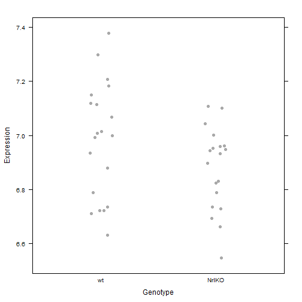
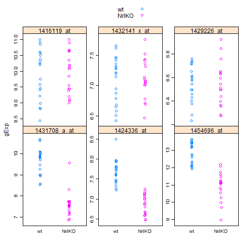
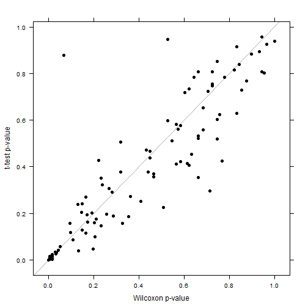
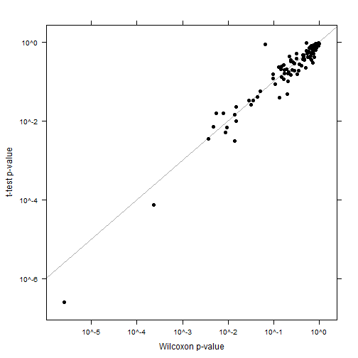

Seminar 4: Two group comparisons and data aggregation
========================================================
### Lauren Chong

Load in the data:

```r
library(lattice)
library(plyr)
library(xtable)
prDat <- read.table("GSE4051_data.tsv")
str(prDat, max.level = 0)
```

```
## 'data.frame':	29949 obs. of  39 variables:
```

```r

prDes <- readRDS("GSE4051_design.rds")
str(prDes)
```

```
## 'data.frame':	39 obs. of  4 variables:
##  $ sidChar : chr  "Sample_20" "Sample_21" "Sample_22" "Sample_23" ...
##  $ sidNum  : num  20 21 22 23 16 17 6 24 25 26 ...
##  $ devStage: Factor w/ 5 levels "E16","P2","P6",..: 1 1 1 1 1 1 1 2 2 2 ...
##  $ gType   : Factor w/ 2 levels "wt","NrlKO": 1 1 1 1 2 2 2 1 1 1 ...
```


### Two sample tests -- one gene
Randomly choose a gene, and extract its data:

```r
set.seed(540)
(myGene <- sample(1:nrow(prDat), size = 1))
```

```
## [1] 1594
```

```r
pDat <- data.frame(prDes, gExp = unlist(prDat[myGene, ]))
str(pDat)
```

```
## 'data.frame':	39 obs. of  5 variables:
##  $ sidChar : chr  "Sample_20" "Sample_21" "Sample_22" "Sample_23" ...
##  $ sidNum  : num  20 21 22 23 16 17 6 24 25 26 ...
##  $ devStage: Factor w/ 5 levels "E16","P2","P6",..: 1 1 1 1 1 1 1 2 2 2 ...
##  $ gType   : Factor w/ 2 levels "wt","NrlKO": 1 1 1 1 2 2 2 1 1 1 ...
##  $ gExp    : num  7.38 7.21 7.3 7 6.95 ...
```


Explore the data a bit (try different summary fxns):

```r
aggregate(gExp ~ gType, pDat, FUN = mean)
```

```
##   gType  gExp
## 1    wt 6.983
## 2 NrlKO 6.877
```

```r
ddply(pDat, ~gType, summarize, expMean = mean(gExp))
```

```
##   gType expMean
## 1    wt   6.983
## 2 NrlKO   6.877
```

```r
ddply(pDat, ~gType, function(x) return(c(expMean = mean(x$gExp))))
```

```
##   gType expMean
## 1    wt   6.983
## 2 NrlKO   6.877
```


Do a sanity-check plot:

```r
stripplot(gExp ~ gType, pDat, pch = 19, col = "darkgrey", jitter = TRUE, ylab = "Expression", 
    xlab = "Genotype")
```

 


Now try a t-test to see if the expression is different between genotypes:

```r
# Without using common variance assumption
t.test(gExp ~ gType, pDat)
```

```
## 
## 	Welch Two Sample t-test
## 
## data:  gExp by gType
## t = 1.788, df = 34.51, p-value = 0.08252
## alternative hypothesis: true difference in means is not equal to 0
## 95 percent confidence interval:
##  -0.01438  0.22616
## sample estimates:
##    mean in group wt mean in group NrlKO 
##               6.983               6.877
```

```r
# WITH common variance assumption
t.test(gExp ~ gType, pDat, var.equal = TRUE)
```

```
## 
## 	Two Sample t-test
## 
## data:  gExp by gType
## t = 1.773, df = 37, p-value = 0.08441
## alternative hypothesis: true difference in means is not equal to 0
## 95 percent confidence interval:
##  -0.0151  0.2269
## sample estimates:
##    mean in group wt mean in group NrlKO 
##               6.983               6.877
```


In both cases, the p-values indicate the genotype effect is not significant for this gene. Let's try other types of tests:

```r
wilcox.test(gExp ~ gType, pDat, exact = FALSE)
```

```
## 
## 	Wilcoxon rank sum test with continuity correction
## 
## data:  gExp by gType
## W = 250.5, p-value = 0.09179
## alternative hypothesis: true location shift is not equal to 0
```

```r
ks.test(x = pDat[pDat$gType == "wt", "gExp"], y = pDat[pDat$gType == "NrlKO", 
    "gExp"], exact = FALSE)
```

```
## Warning: p-value will be approximate in the presence of ties
```

```
## 
## 	Two-sample Kolmogorov-Smirnov test
## 
## data:  pDat[pDat$gType == "wt", "gExp"] and pDat[pDat$gType == "NrlKO", "gExp"]
## D = 0.3895, p-value = 0.104
## alternative hypothesis: two-sided
```

Looks like the Wilcoxon and Kolmogorov-Smirnov tests agree that the effect is not significant.

### Two sample tests -- a handful of genes
Grab the data from 6 genes:

```r
keepGenes <- c("1431708_a_at", "1424336_at", "1454696_at", "1416119_at", "1432141_x_at", 
    "1429226_at")
miniDat <- subset(prDat, rownames(prDat) %in% keepGenes)
miniDat <- data.frame(gExp = as.vector(t(as.matrix(miniDat))), gene = factor(rep(rownames(miniDat), 
    each = ncol(miniDat)), levels = keepGenes))
miniDat <- suppressWarnings(data.frame(prDes, miniDat))
str(miniDat)
```

```
## 'data.frame':	234 obs. of  6 variables:
##  $ sidChar : chr  "Sample_20" "Sample_21" "Sample_22" "Sample_23" ...
##  $ sidNum  : num  20 21 22 23 16 17 6 24 25 26 ...
##  $ devStage: Factor w/ 5 levels "E16","P2","P6",..: 1 1 1 1 1 1 1 2 2 2 ...
##  $ gType   : Factor w/ 2 levels "wt","NrlKO": 1 1 1 1 2 2 2 1 1 1 ...
##  $ gExp    : num  10.6 11 10.8 10.9 9.2 ...
##  $ gene    : Factor w/ 6 levels "1431708_a_at",..: 4 4 4 4 4 4 4 4 4 4 ...
```


Plot to ensure we have some interesting and some boring genes:

```r
stripplot(gExp ~ gType | gene, miniDat, scales = list(y = list(relation = "free")), 
    group = gType, auto.key = TRUE, jitter = TRUE)
```

 


Now do t-tests for these genes:

```r
ttRes <- ddply(miniDat, ~gene, function(x) {
    res <- t.test(gExp ~ gType, x)
    return(c(pval = res$p.value))
})
```


```r
foo <- xtable(ttRes)
print(foo, type = "html", include.rownames = FALSE)
```

<!-- html table generated in R 3.0.2 by xtable 1.7-3 package -->
<!-- Mon Apr 07 20:32:22 2014 -->
<TABLE border=1>
<TR> <TH> gene </TH> <TH> pval </TH>  </TR>
  <TR> <TD> 1431708_a_at </TD> <TD align="right"> 0.00 </TD> </TR>
  <TR> <TD> 1424336_at </TD> <TD align="right"> 0.00 </TD> </TR>
  <TR> <TD> 1454696_at </TD> <TD align="right"> 0.00 </TD> </TR>
  <TR> <TD> 1416119_at </TD> <TD align="right"> 0.86 </TD> </TR>
  <TR> <TD> 1432141_x_at </TD> <TD align="right"> 0.90 </TD> </TR>
  <TR> <TD> 1429226_at </TD> <TD align="right"> 0.92 </TD> </TR>
   </TABLE>


### Concordance of two-group tests
Grab data for 100 genes at random:

```r
myGenes <- rownames(prDat)[sample(1:nrow(prDat), size = 100)]
myDat <- prDat[myGenes, ]
myDat <- data.frame(gExp = as.vector(t(as.matrix(myDat))), gene = factor(rep(myGenes, 
    each = ncol(myDat)), levels = myGenes))
myDat <- suppressWarnings(data.frame(prDes, myDat))
```


Now get p-values from t-test and Wilcoxon test for each gene:

```r
pValDat <- ddply(myDat, ~gene, function(x) {
    ttRes <- t.test(gExp ~ gType, x)
    wRes <- wilcox.test(gExp ~ gType, x, exact = FALSE)
    return(c(ttPval = ttRes$p.value, wPval = wRes$p.value))
})
xyplot(ttPval ~ wPval, pValDat, panel = function(x, y, ...) {
    panel.abline(a = 0, b = 1, col = "darkgrey")
    panel.xyplot(x, y, ...)
}, ylab = "t-test p-value", xlab = "Wilcoxon p-value", pch = 19, col = "black")
```

 


Interesting! Looks like the p-values aren't so concordant. What about log-transformed?

```r
xyplot(ttPval ~ wPval, pValDat, panel = function(x, y, ...) {
    panel.abline(a = 0, b = 1, col = "darkgrey")
    panel.xyplot(x, y, ...)
}, ylab = "t-test p-value", xlab = "Wilcoxon p-value", pch = 19, col = "black", 
    scales = list(x = list(log = TRUE), y = list(log = TRUE)))
```

 

In particular, the less significant genes (higher p-values) are less concordant.
