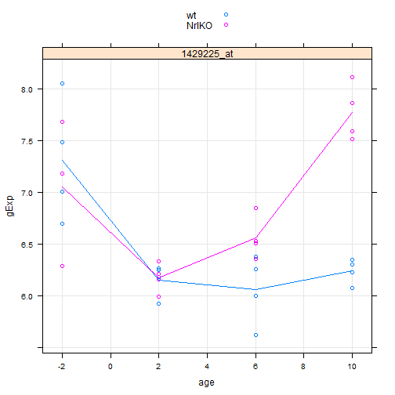

Seminar 5: Fitting and interpreting linear models (low volume)
==============================================================
### Lauren Chong

Load the data:

```r
library(lattice)
library(reshape2)
prDat <- read.table("GSE4051_data.tsv")
str(prDat, max.level = 0)
```

```
## 'data.frame':	29949 obs. of  39 variables:
```

```r
prDes <- readRDS("GSE4051_design.rds")
str(prDes)
```

```
## 'data.frame':	39 obs. of  4 variables:
##  $ sidChar : chr  "Sample_20" "Sample_21" "Sample_22" "Sample_23" ...
##  $ sidNum  : num  20 21 22 23 16 17 6 24 25 26 ...
##  $ devStage: Factor w/ 5 levels "E16","P2","P6",..: 1 1 1 1 1 1 1 2 2 2 ...
##  $ gType   : Factor w/ 2 levels "wt","NrlKO": 1 1 1 1 2 2 2 1 1 1 ...
```


Write a function to extract info for a list of genes:

```r
prepareData <- function(myGenes) {
    genesDat <- prDat[myGenes, ]
    genesDat <- data.frame(gExp = as.vector(t(as.matrix(genesDat))), gene = factor(rep(myGenes, 
        each = ncol(genesDat)), levels = myGenes))
    genesDat <- suppressWarnings(data.frame(prDes, genesDat))
    return(genesDat)
}

# Test it out
(luckyGenes <- c("1419655_at", "1438815_at"))
```

```
## [1] "1419655_at" "1438815_at"
```

```r
lDat <- prepareData(luckyGenes)
str(lDat)
```

```
## 'data.frame':	78 obs. of  6 variables:
##  $ sidChar : chr  "Sample_20" "Sample_21" "Sample_22" "Sample_23" ...
##  $ sidNum  : num  20 21 22 23 16 17 6 24 25 26 ...
##  $ devStage: Factor w/ 5 levels "E16","P2","P6",..: 1 1 1 1 1 1 1 2 2 2 ...
##  $ gType   : Factor w/ 2 levels "wt","NrlKO": 1 1 1 1 2 2 2 1 1 1 ...
##  $ gExp    : num  10.93 10.74 10.67 10.68 9.61 ...
##  $ gene    : Factor w/ 2 levels "1419655_at","1438815_at": 1 1 1 1 1 1 1 1 1 1 ...
```

```r
head(lDat)
```

```
##     sidChar sidNum devStage gType   gExp       gene
## 1 Sample_20     20      E16    wt 10.930 1419655_at
## 2 Sample_21     21      E16    wt 10.740 1419655_at
## 3 Sample_22     22      E16    wt 10.670 1419655_at
## 4 Sample_23     23      E16    wt 10.680 1419655_at
## 5 Sample_16     16      E16 NrlKO  9.606 1419655_at
## 6 Sample_17     17      E16 NrlKO 10.840 1419655_at
```

```r

stripplot(gExp ~ devStage | gene, lDat, group = gType, jitter.data = TRUE, auto.key = TRUE, 
    type = c("p", "a"), grid = TRUE)
```

 


Borrow the makestripplot function from Jenny's code:

```r
makeStripplot <- function(myData, ...) {
    stripplot(gExp ~ devStage | gene, myData, group = gType, jitter.data = TRUE, 
        auto.key = TRUE, type = c("p", "a"), grid = TRUE, ...)
}
```


Further work
------------
Retry some similar analyses from the tutorial, but treat developmental stage as a numerical variable. Drop the last time point too, as per Jenny's observations:

```r
library(car)
```

```
## Warning: package 'car' was built under R version 3.0.3
```

```r
prDes$age <- +recode(prDes$devStage, "'E16'=-2; 'P2'=2; 'P6'=6; 'P10'=10; '4_weeks'=28", 
    as.factor.result = FALSE)
prDes <- prDes[prDes$devStage != "4_weeks", ]
prDat <- prDat[, prDes$sidChar]
```


### Gene 1
Experiment with a single gene of interest:

```r
oDat <- prepareData("1448690_at")
xyplot(gExp ~ age | gene, oDat, group = gType, jitter.data = TRUE, auto.key = TRUE, 
    type = c("p", "a"), grid = TRUE)
```

 

```r
fit.lm <- lm(gExp ~ age * gType, oDat)
summary(fit.lm)
```

```
## 
## Call:
## lm(formula = gExp ~ age * gType, data = oDat)
## 
## Residuals:
##    Min     1Q Median     3Q    Max 
## -1.270 -0.385  0.200  0.421  0.970 
## 
## Coefficients:
##                Estimate Std. Error t value Pr(>|t|)    
## (Intercept)      8.1403     0.2016   40.37  < 2e-16 ***
## age             -0.1866     0.0336   -5.55  6.9e-06 ***
## gTypeNrlKO      -0.8319     0.2993   -2.78   0.0098 ** 
## age:gTypeNrlKO   0.0231     0.0491    0.47   0.6422    
## ---
## Signif. codes:  0 '***' 0.001 '**' 0.01 '*' 0.05 '.' 0.1 ' ' 1
## 
## Residual standard error: 0.601 on 27 degrees of freedom
## Multiple R-squared:  0.708,	Adjusted R-squared:  0.676 
## F-statistic: 21.9 on 3 and 27 DF,  p-value: 2.17e-07
```


Our fitted model tells us there is no significant interaction effect. Try a new model with no interaction, and compare the results using ANOVA:

```r
fit.lm.noint <- lm(gExp ~ age + gType, oDat)
summary(fit.lm.noint)
```

```
## 
## Call:
## lm(formula = gExp ~ age + gType, data = oDat)
## 
## Residuals:
##    Min     1Q Median     3Q    Max 
## -1.248 -0.390  0.187  0.412  0.891 
## 
## Coefficients:
##             Estimate Std. Error t value Pr(>|t|)    
## (Intercept)   8.0971     0.1769   45.77  < 2e-16 ***
## age          -0.1758     0.0242   -7.28  6.4e-08 ***
## gTypeNrlKO   -0.7347     0.2132   -3.45   0.0018 ** 
## ---
## Signif. codes:  0 '***' 0.001 '**' 0.01 '*' 0.05 '.' 0.1 ' ' 1
## 
## Residual standard error: 0.593 on 28 degrees of freedom
## Multiple R-squared:  0.706,	Adjusted R-squared:  0.685 
## F-statistic: 33.6 on 2 and 28 DF,  p-value: 3.61e-08
```

```r
anova(fit.lm.noint, fit.lm)
```

```
## Analysis of Variance Table
## 
## Model 1: gExp ~ age + gType
## Model 2: gExp ~ age * gType
##   Res.Df  RSS Df Sum of Sq    F Pr(>F)
## 1     28 9.84                         
## 2     27 9.76  1    0.0798 0.22   0.64
```


The large p-value indicates that adding the interactions is unnecessary.

### Gene 2
Now try analysis with a more interesting gene:

```r
pDat <- prepareData("1429225_at")
xyplot(gExp ~ age | gene, pDat, group = gType, jitter.data = TRUE, auto.key = TRUE, 
    type = c("p", "a"), grid = TRUE)
```

 


This looks like it may be non-linear, so try comparing linear and quadratic age models:

```r
quad.fit.small <- lm(formula = gExp ~ age, data = pDat)
summary(quad.fit.small)
```

```
## 
## Call:
## lm(formula = gExp ~ age, data = pDat)
## 
## Residuals:
##    Min     1Q Median     3Q    Max 
## -1.025 -0.437 -0.288  0.405  1.499 
## 
## Coefficients:
##             Estimate Std. Error t value Pr(>|t|)    
## (Intercept)  6.67962    0.17312   38.58   <2e-16 ***
## age         -0.00612    0.02845   -0.22     0.83    
## ---
## Signif. codes:  0 '***' 0.001 '**' 0.01 '*' 0.05 '.' 0.1 ' ' 1
## 
## Residual standard error: 0.698 on 29 degrees of freedom
## Multiple R-squared:  0.0016,	Adjusted R-squared:  -0.0328 
## F-statistic: 0.0463 on 1 and 29 DF,  p-value: 0.831
```

```r
quad.fit <- lm(formula = gExp ~ age + I(age^2), data = pDat)
summary(quad.fit)
```

```
## 
## Call:
## lm(formula = gExp ~ age + I(age^2), data = pDat)
## 
## Residuals:
##     Min      1Q  Median      3Q     Max 
## -0.9611 -0.3035  0.0075  0.3195  1.0789 
## 
## Coefficients:
##             Estimate Std. Error t value Pr(>|t|)    
## (Intercept)  6.60425    0.13679   48.28  < 2e-16 ***
## age         -0.22632    0.05498   -4.12  0.00031 ***
## I(age^2)     0.02697    0.00616    4.38  0.00015 ***
## ---
## Signif. codes:  0 '***' 0.001 '**' 0.01 '*' 0.05 '.' 0.1 ' ' 1
## 
## Residual standard error: 0.548 on 28 degrees of freedom
## Multiple R-squared:  0.408,	Adjusted R-squared:  0.365 
## F-statistic: 9.64 on 2 and 28 DF,  p-value: 0.000654
```

```r
anova(quad.fit.small, quad.fit)
```

```
## Analysis of Variance Table
## 
## Model 1: gExp ~ age
## Model 2: gExp ~ age + I(age^2)
##   Res.Df   RSS Df Sum of Sq    F  Pr(>F)    
## 1     29 14.15                              
## 2     28  8.39  1      5.75 19.2 0.00015 ***
## ---
## Signif. codes:  0 '***' 0.001 '**' 0.01 '*' 0.05 '.' 0.1 ' ' 1
```


The p-value is very significant, meaning that the quadratic model is a big improvement. Now see if adding genotype changes anything:

```r
quad.fit.gtype <- lm(formula = gExp ~ gType + (age + I(age^2)), data = pDat)
summary(quad.fit.gtype)
```

```
## 
## Call:
## lm(formula = gExp ~ gType + (age + I(age^2)), data = pDat)
## 
## Residuals:
##     Min      1Q  Median      3Q     Max 
## -1.1411 -0.3146  0.0491  0.2656  1.0961 
## 
## Coefficients:
##             Estimate Std. Error t value Pr(>|t|)    
## (Intercept)   6.3849     0.1496   42.67  < 2e-16 ***
## gTypeNrlKO    0.4713     0.1791    2.63    0.014 *  
## age          -0.2330     0.0500   -4.66  7.6e-05 ***
## I(age^2)      0.0275     0.0056    4.91  3.8e-05 ***
## ---
## Signif. codes:  0 '***' 0.001 '**' 0.01 '*' 0.05 '.' 0.1 ' ' 1
## 
## Residual standard error: 0.497 on 27 degrees of freedom
## Multiple R-squared:  0.529,	Adjusted R-squared:  0.476 
## F-statistic: 10.1 on 3 and 27 DF,  p-value: 0.000124
```

```r
anova(quad.fit, quad.fit.gtype)
```

```
## Analysis of Variance Table
## 
## Model 1: gExp ~ age + I(age^2)
## Model 2: gExp ~ gType + (age + I(age^2))
##   Res.Df  RSS Df Sum of Sq    F Pr(>F)  
## 1     28 8.39                           
## 2     27 6.68  1      1.71 6.93  0.014 *
## ---
## Signif. codes:  0 '***' 0.001 '**' 0.01 '*' 0.05 '.' 0.1 ' ' 1
```


So it looks like adding the genotype information is moderately informative. What about an interaction effect?

```r
quad.fit.int <- lm(formula = gExp ~ gType * (age + I(age^2)), data = pDat)
summary(quad.fit.int)
```

```
## 
## Call:
## lm(formula = gExp ~ gType * (age + I(age^2)), data = pDat)
## 
## Residuals:
##     Min      1Q  Median      3Q     Max 
## -0.7323 -0.2022 -0.0069  0.1285  0.7844 
## 
## Coefficients:
##                     Estimate Std. Error t value Pr(>|t|)    
## (Intercept)          6.68978    0.12003   55.74  < 2e-16 ***
## gTypeNrlKO          -0.18829    0.17670   -1.07  0.29679    
## age                 -0.24966    0.04817   -5.18  2.3e-05 ***
## I(age^2)             0.02088    0.00550    3.80  0.00083 ***
## gTypeNrlKO:age       0.05376    0.07104    0.76  0.45629    
## gTypeNrlKO:I(age^2)  0.01164    0.00793    1.47  0.15475    
## ---
## Signif. codes:  0 '***' 0.001 '**' 0.01 '*' 0.05 '.' 0.1 ' ' 1
## 
## Residual standard error: 0.352 on 25 degrees of freedom
## Multiple R-squared:  0.782,	Adjusted R-squared:  0.738 
## F-statistic: 17.9 on 5 and 25 DF,  p-value: 1.5e-07
```

```r
anova(quad.fit, quad.fit.int)
```

```
## Analysis of Variance Table
## 
## Model 1: gExp ~ age + I(age^2)
## Model 2: gExp ~ gType * (age + I(age^2))
##   Res.Df  RSS Df Sum of Sq    F  Pr(>F)    
## 1     28 8.39                              
## 2     25 3.09  3       5.3 14.3 1.3e-05 ***
## ---
## Signif. codes:  0 '***' 0.001 '**' 0.01 '*' 0.05 '.' 0.1 ' ' 1
```


Adding an interaction between age and genotype appears to be a significant improvement. This is the best model we have tried for this gene.

### Conclusions
Using a numerical covariate for age allowed us to fit quadratic models which were more appropriate for the 2nd gene.
