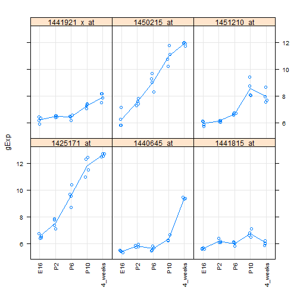
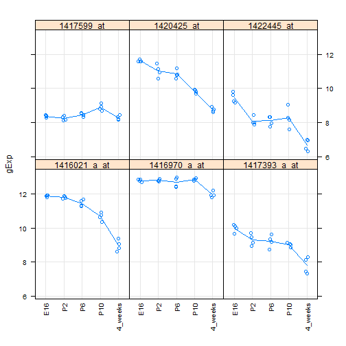
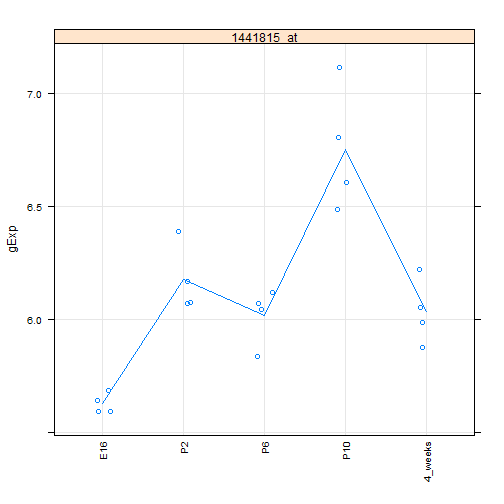
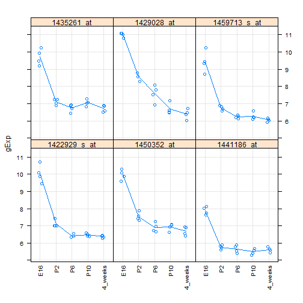
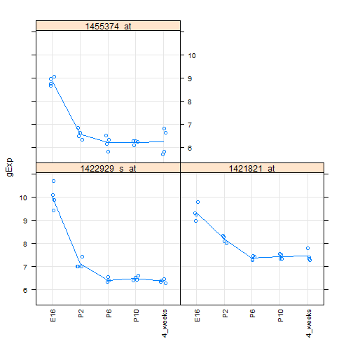

Seminar 6 -- Fitting and interpreting linear models (high volume)
=================================================================
### Lauren Chong

Load libraries and data:

```r
library(limma)
library(lattice)

prDat <- read.table("GSE4051_data.tsv")
str(prDat, max.level = 0)
```

```
## 'data.frame':	29949 obs. of  39 variables:
```

```r

prDes <- readRDS("GSE4051_design.rds")
str(prDes)
```

```
## 'data.frame':	39 obs. of  4 variables:
##  $ sidChar : chr  "Sample_20" "Sample_21" "Sample_22" "Sample_23" ...
##  $ sidNum  : num  20 21 22 23 16 17 6 24 25 26 ...
##  $ devStage: Factor w/ 5 levels "E16","P2","P6",..: 1 1 1 1 1 1 1 2 2 2 ...
##  $ gType   : Factor w/ 2 levels "wt","NrlKO": 1 1 1 1 2 2 2 1 1 1 ...
```


Grab just the wild-type data (used for this tutorial) and set up some functions for extracting and plotting data:

```r
wtDes <- subset(prDes, gType == "wt")
str(wtDes)
```

```
## 'data.frame':	20 obs. of  4 variables:
##  $ sidChar : chr  "Sample_20" "Sample_21" "Sample_22" "Sample_23" ...
##  $ sidNum  : num  20 21 22 23 24 25 26 27 28 29 ...
##  $ devStage: Factor w/ 5 levels "E16","P2","P6",..: 1 1 1 1 2 2 2 2 3 3 ...
##  $ gType   : Factor w/ 2 levels "wt","NrlKO": 1 1 1 1 1 1 1 1 1 1 ...
```

```r

wtDat <- subset(prDat, select = prDes$gType == "wt")
str(wtDat, max.level = 0)
```

```
## 'data.frame':	29949 obs. of  20 variables:
```

```r

prepareData <- function(myGenes) {
    genesDat <- wtDat[myGenes, ]
    genesDat <- data.frame(gExp = as.vector(t(as.matrix(genesDat))), gene = factor(rep(myGenes, 
        each = ncol(genesDat)), levels = myGenes))
    genesDat <- suppressWarnings(data.frame(wtDes, genesDat))
    return(genesDat)
}

makeStripplot <- function(myData, ...) {
    stripplot(gExp ~ devStage | gene, myData, jitter.data = TRUE, scales = list(x = list(rot = 90)), 
        type = c("p", "a"), grid = TRUE, ...)
}
```


For this tutorial, consider the effect of only developmental stage on expression. Use lmFit to create linear models for all genes:

```r
wtDesMat <- model.matrix(~devStage, wtDes)
wtDesMat
```

```
##    (Intercept) devStageP2 devStageP6 devStageP10 devStage4_weeks
## 12           1          0          0           0               0
## 13           1          0          0           0               0
## 14           1          0          0           0               0
## 15           1          0          0           0               0
## 28           1          1          0           0               0
## 29           1          1          0           0               0
## 30           1          1          0           0               0
## 31           1          1          0           0               0
## 36           1          0          1           0               0
## 37           1          0          1           0               0
## 38           1          0          1           0               0
## 39           1          0          1           0               0
## 20           1          0          0           1               0
## 21           1          0          0           1               0
## 22           1          0          0           1               0
## 23           1          0          0           1               0
## 5            1          0          0           0               1
## 6            1          0          0           0               1
## 7            1          0          0           0               1
## 8            1          0          0           0               1
## attr(,"assign")
## [1] 0 1 1 1 1
## attr(,"contrasts")
## attr(,"contrasts")$devStage
## [1] "contr.treatment"
```

```r
wtFit <- lmFit(wtDat, wtDesMat)
wtEbFit <- eBayes(wtFit)
```


Count the number of genes with FDR < 1e-5:

```r
hits <- topTable(wtEbFit, coef = grep("devStage", colnames(coef(wtEbFit))), 
    number = Inf, p.value = 1e-05)
dim(hits)
```

```
## [1] 350   8
```

So there are 350 such hits.

### Contrasts
Now consider some contrasts between different levels of developmental stage.

First consider the differences observed at the latest 3 stages:

```r
colnames(wtDesMat)
```

```
## [1] "(Intercept)"     "devStageP2"      "devStageP6"      "devStageP10"    
## [5] "devStage4_weeks"
```

```r
(cont.matrix <- makeContrasts(P10VsP6 = devStageP10 - devStageP6, fourweeksVsP10 = devStage4_weeks - 
    devStageP10, levels = wtDesMat))
```

```
## Warning: Renaming (Intercept) to Intercept
```

```
##                  Contrasts
## Levels            P10VsP6 fourweeksVsP10
##   Intercept             0              0
##   devStageP2            0              0
##   devStageP6           -1              0
##   devStageP10           1             -1
##   devStage4_weeks       0              1
```

```r
wtFitCont <- contrasts.fit(wtFit, cont.matrix)
```

```
## Warning: row names of contrasts don't match col names of coefficients
```

```r
wtEbFitCont <- eBayes(wtFitCont)
topTable(wtEbFitCont)
```

```
##              P10VsP6 fourweeksVsP10 AveExpr     F   P.Value adj.P.Val
## 1440645_at    0.7247          3.041   6.528 632.7 2.224e-17 6.662e-13
## 1416041_at   -0.1470          4.782   9.383 302.4 1.473e-14 2.206e-10
## 1425222_x_at  0.7492          3.983   7.028 235.4 1.300e-13 1.297e-09
## 1424852_at    0.3442          3.405   7.454 225.1 1.910e-13 1.430e-09
## 1420726_x_at  0.1732          3.551   7.190 203.5 4.555e-13 2.640e-09
## 1451635_at    0.8260          4.172   8.319 200.0 5.289e-13 2.640e-09
## 1429394_at   -0.0980          2.410   7.848 167.5 2.416e-12 1.034e-08
## 1455447_at   -0.9765         -1.800   9.973 153.5 5.063e-12 1.896e-08
## 1429791_at    0.2480          1.658   8.026 145.7 7.877e-12 2.621e-08
## 1422612_at    0.4837          3.426   8.833 142.2 9.676e-12 2.840e-08
```


Adjust the p-values:

```r
cutoff <- 0.01
wtResCont <- decideTests(wtEbFitCont, p.value = cutoff, method = "global")
summary(wtResCont)
```

```
##    P10VsP6 fourweeksVsP10
## -1      40             49
## 0    29897          29636
## 1       12            264
```


Plot a few of the interesting genes we've found:

```r
ids1 <- names(which(wtResCont[, "P10VsP6"] > 0))
makeStripplot(prepareData(ids1[1:6]))
```

 

```r

ids2 <- names(which(wtResCont[, "fourweeksVsP10"] < 0))
makeStripplot(prepareData(ids2[1:6]))
```

 

```r

cool.id <- intersect(ids1, ids2)
makeStripplot(prepareData(cool.id))
```

 


## Take-home exercise
Find probes where expression changes before P6 but not after.

Start by finding genes with expression changes in early stages. Since we already have the fitted linear model, we can just extract matches using topTable and selecting coefficients for P2 and P6:

```r
early.hits <- topTable(wtEbFit, coef = c("devStageP2", "devStageP6"), number = 5000, 
    p.value = 1e-05)
early.hits.ids <- rownames(early.hits)
```


Plot some early hits for verification:

```r
makeStripplot(prepareData(early.hits.ids[1:6]))
```

 


Utilize our existing contrast results for P6 to 4 weeks to find 3 genes that change in early stages and are steady in late stages.

```r
late.hits <- topTable(wtEbFitCont, number = Inf)
late.hits.ids <- rownames(tail(late.hits, n = 5000))

hit.matches <- intersect(early.hits.ids, late.hits.ids)
makeStripplot(prepareData(hit.matches[1:3]))
```

 

