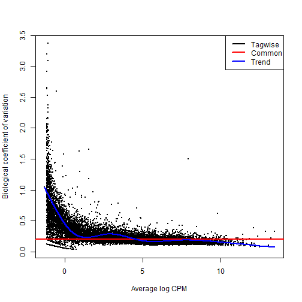
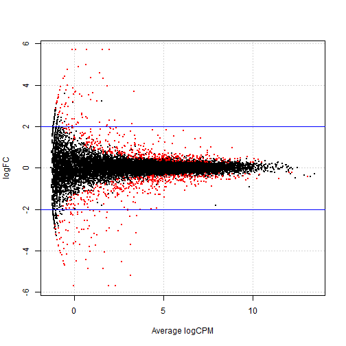

STAT 540 -- Seminar 7
========================================================

Looking at read count data from RNA-seq of 21 mice (2 strains).

Load packages:

```r
library(edgeR)
```

```
## Loading required package: limma
```


Load the data:

```r
dat <- read.table("bottomly_count_table.tsv", header = TRUE, row.names = 1)
des <- read.table("bottomly_phenodata.tsv", header = TRUE, row.names = 1)
dim(dat)
```

```
## [1] 36536    21
```

```r
head(dat)
```

```
##                    SRX033480 SRX033488 SRX033481 SRX033489 SRX033482
## ENSMUSG00000000001       369       744       287       769       348
## ENSMUSG00000000003         0         0         0         0         0
## ENSMUSG00000000028         0         1         0         1         1
## ENSMUSG00000000031         0         0         0         0         0
## ENSMUSG00000000037         0         1         1         5         0
## ENSMUSG00000000049         0         1         0         1         0
##                    SRX033490 SRX033483 SRX033476 SRX033478 SRX033479
## ENSMUSG00000000001       803       433       469       585       321
## ENSMUSG00000000003         0         0         0         0         0
## ENSMUSG00000000028         1         0         7         6         1
## ENSMUSG00000000031         0         0         0         0         0
## ENSMUSG00000000037         4         0         0         0         0
## ENSMUSG00000000049         0         0         0         0         0
##                    SRX033472 SRX033473 SRX033474 SRX033475 SRX033491
## ENSMUSG00000000001       301       461       309       374       781
## ENSMUSG00000000003         0         0         0         0         0
## ENSMUSG00000000028         1         1         1         1         1
## ENSMUSG00000000031         0         0         0         0         0
## ENSMUSG00000000037         4         1         1         0         1
## ENSMUSG00000000049         0         0         0         0         0
##                    SRX033484 SRX033492 SRX033485 SRX033493 SRX033486
## ENSMUSG00000000001       555       820       294       758       419
## ENSMUSG00000000003         0         0         0         0         0
## ENSMUSG00000000028         2         1         1         4         1
## ENSMUSG00000000031         0         0         0         0         0
## ENSMUSG00000000037         2         1         1         1         1
## ENSMUSG00000000049         0         0         0         0         0
##                    SRX033494
## ENSMUSG00000000001       857
## ENSMUSG00000000003         0
## ENSMUSG00000000028         5
## ENSMUSG00000000031         0
## ENSMUSG00000000037         2
## ENSMUSG00000000049         0
```

```r
show(des)
```

```
##           num.tech.reps   strain experiment.number lane.number
## SRX033480             1 C57BL/6J                 6           1
## SRX033488             1 C57BL/6J                 7           1
## SRX033481             1 C57BL/6J                 6           2
## SRX033489             1 C57BL/6J                 7           2
## SRX033482             1 C57BL/6J                 6           3
## SRX033490             1 C57BL/6J                 7           3
## SRX033483             1 C57BL/6J                 6           5
## SRX033476             1 C57BL/6J                 4           6
## SRX033478             1 C57BL/6J                 4           7
## SRX033479             1 C57BL/6J                 4           8
## SRX033472             1   DBA/2J                 4           1
## SRX033473             1   DBA/2J                 4           2
## SRX033474             1   DBA/2J                 4           3
## SRX033475             1   DBA/2J                 4           5
## SRX033491             1   DBA/2J                 7           5
## SRX033484             1   DBA/2J                 6           6
## SRX033492             1   DBA/2J                 7           6
## SRX033485             1   DBA/2J                 6           7
## SRX033493             1   DBA/2J                 7           7
## SRX033486             1   DBA/2J                 6           8
## SRX033494             1   DBA/2J                 7           8
```


edgeR analysis
--------------
First we will run our DE analysis using edgeR to model the expression.  

Create a DGEList separating the samples by strain, and then a design matrix for model fitting:

```r
group <- factor(as.numeric(des$strain))
dge.glm <- DGEList(counts = dat, group = group)
show(dge.glm$samples)
```

```
##           group lib.size norm.factors
## SRX033480     1  3040296            1
## SRX033488     1  6303665            1
## SRX033481     1  2717092            1
## SRX033489     1  6545795            1
## SRX033482     1  3016179            1
## SRX033490     1  7097379            1
## SRX033483     1  3707895            1
## SRX033476     1  5165144            1
## SRX033478     1  4953201            1
## SRX033479     1  4192872            1
## SRX033472     2  3970729            1
## SRX033473     2  4733003            1
## SRX033474     2  3702051            1
## SRX033475     2  3569483            1
## SRX033491     2  7276198            1
## SRX033484     2  4422272            1
## SRX033492     2  7115851            1
## SRX033485     2  3467730            1
## SRX033493     2  7339817            1
## SRX033486     2  3879114            1
## SRX033494     2  6771680            1
```

```r
design <- model.matrix(~group)
show(design)
```

```
##    (Intercept) group2
## 1            1      0
## 2            1      0
## 3            1      0
## 4            1      0
## 5            1      0
## 6            1      0
## 7            1      0
## 8            1      0
## 9            1      0
## 10           1      0
## 11           1      1
## 12           1      1
## 13           1      1
## 14           1      1
## 15           1      1
## 16           1      1
## 17           1      1
## 18           1      1
## 19           1      1
## 20           1      1
## 21           1      1
## attr(,"assign")
## [1] 0 1
## attr(,"contrasts")
## attr(,"contrasts")$group
## [1] "contr.treatment"
```


Estimate dispersion for each probe:

```r
dge.glm.com.disp <- estimateGLMCommonDisp(dge.glm, design, verbose = TRUE)
```

```
## Disp = 0.03893 , BCV = 0.1973
```

```r
dge.glm.trend.disp <- estimateGLMTrendedDisp(dge.glm.com.disp, design)
```

```
## Loading required package: splines
```

```r
dge.glm.tag.disp <- estimateGLMTagwiseDisp(dge.glm.trend.disp, design)
plotBCV(dge.glm.tag.disp)
```

 


Fit an adjusted linear model, run likelihood test:

```r
fit <- glmFit(dge.glm.tag.disp, design)
lrt <- glmLRT(fit, coef = 2)
```


We want to identify genes that show significantly different expression between the two strains. Look at the top 10 most significant results:

```r
topTags(lrt)
```

```
## Coefficient:  group2 
##                     logFC logCPM    LR    PValue       FDR
## ENSMUSG00000020912 -5.187  3.155 401.8 2.238e-89 8.177e-85
## ENSMUSG00000050141 -5.363  2.319 311.6 9.787e-70 1.788e-65
## ENSMUSG00000035775 -4.543  2.674 298.0 9.042e-67 1.101e-62
## ENSMUSG00000015484 -1.968  4.307 282.5 2.113e-63 1.930e-59
## ENSMUSG00000024248 -3.152  3.463 277.0 3.337e-62 2.438e-58
## ENSMUSG00000030532  1.547  5.572 269.4 1.568e-60 9.548e-57
## ENSMUSG00000054354 -6.283  1.940 249.3 3.657e-56 1.909e-52
## ENSMUSG00000023236  1.426  7.067 245.0 3.133e-55 1.431e-51
## ENSMUSG00000050824  3.705  3.365 229.7 7.099e-52 2.882e-48
## ENSMUSG00000015852 -2.362  3.138 214.8 1.210e-48 4.049e-45
```


Get counts of significant genes (FDR-adjusted p-val < 0.01):

```r
tt.glm <- topTags(lrt, n = Inf)
nrow(tt.glm$table[tt.glm$table$FDR < 0.01, ])
```

```
## [1] 600
```


Now grab the names of some highly significant genes:

```r
interestingSamples <- rownames(tt.glm$table[tt.glm$table$FDR < 1e-50, ])
cpm(dge.glm.tag.disp)[interestingSamples, ]
```

```
##                    SRX033480 SRX033488 SRX033481 SRX033489 SRX033482
## ENSMUSG00000020912     20.39    12.691     15.83    14.819    19.230
## ENSMUSG00000050141     14.14    10.153     10.67     6.264     9.946
## ENSMUSG00000035775     14.47    10.629     19.51    11.305    12.930
## ENSMUSG00000015484     26.97    33.949     32.76    36.206    31.497
## ENSMUSG00000024248     14.80    26.017     17.30    23.527    18.567
## ENSMUSG00000030532     27.96    24.906     21.35    25.360    18.567
## ENSMUSG00000054354     10.85     7.615     11.41     8.708     8.289
## ENSMUSG00000023236     65.45    78.684     72.50    72.413    76.587
##                    SRX033490 SRX033483 SRX033476 SRX033478 SRX033479
## ENSMUSG00000020912    17.330    26.430    13.359    23.621    14.310
## ENSMUSG00000050141     7.890     8.361     6.583    11.911    12.402
## ENSMUSG00000035775    12.540    12.136     6.389    13.527    11.210
## ENSMUSG00000015484    33.393    30.745    34.655    26.851    31.482
## ENSMUSG00000024248    25.784    18.879    24.781    14.334    14.310
## ENSMUSG00000030532    26.770    26.430    19.167    23.217    20.034
## ENSMUSG00000054354     7.608     7.012     3.291     4.442     5.963
## ENSMUSG00000023236    80.875    83.336    55.178    57.740    66.303
##                    SRX033472 SRX033473 SRX033474 SRX033475 SRX033491
## ENSMUSG00000020912    0.5037    0.4226    1.0805    0.2802    1.0995
## ENSMUSG00000050141    0.2518    0.0000    0.0000    0.2802    0.8246
## ENSMUSG00000035775    0.7555    0.0000    0.2701    0.2802    0.6872
## ENSMUSG00000015484    7.0516    4.8595    9.1841    7.8443    8.5209
## ENSMUSG00000024248    2.2666    1.2677    1.8908    3.3618    3.1610
## ENSMUSG00000030532   69.7605   70.5683   63.2082   63.0343   73.8023
## ENSMUSG00000054354    0.0000    0.0000    0.0000    0.0000    0.5497
## ENSMUSG00000023236  195.4301  183.6044  176.1186  156.3252  206.9762
##                    SRX033484 SRX033492 SRX033485 SRX033493 SRX033486
## ENSMUSG00000020912    0.0000    0.7027    0.8651    0.1362    0.0000
## ENSMUSG00000050141    0.0000    0.1405    0.0000    0.1362    0.2578
## ENSMUSG00000035775    0.6784    0.1405    0.5767    0.1362    1.8045
## ENSMUSG00000015484    9.4974    8.4319    8.9396    6.6759   10.3116
## ENSMUSG00000024248    1.5829    1.6864    1.7302    1.7712    2.5779
## ENSMUSG00000030532   70.0997   70.6873   62.5770   78.6123   59.2919
## ENSMUSG00000054354    0.0000    0.0000    0.0000    0.0000    0.0000
## ENSMUSG00000023236  177.9628  192.8090  207.0519  201.6399  204.6859
##                    SRX033494
## ENSMUSG00000020912    0.0000
## ENSMUSG00000050141    0.1477
## ENSMUSG00000035775    0.5907
## ENSMUSG00000015484    8.8604
## ENSMUSG00000024248    3.1012
## ENSMUSG00000030532   71.3265
## ENSMUSG00000054354    0.0000
## ENSMUSG00000023236  192.7144
```


Characterize the number of genes altered in the strains:

```r
summary(de.glm <- decideTestsDGE(lrt, p = 0.05, adjust = "BH"))
```

```
##    [,1] 
## -1   451
## 0  35660
## 1    425
```

There are 451 genes under-expressed in the DBA/2J mice, and 425 that are over-expressed. The remaining 35660 show no significant differences in expression.

Observe the fold-changes:

```r
tags.glm <- rownames(dge.glm.tag.disp)[as.logical(de.glm)]
plotSmear(lrt, de.tags = tags.glm)
abline(h = c(-2, 2), col = "blue")
```

 

