Seminar 9 -- Cluster analysis & PCA
========================================================
### Lauren Chong

Load the libraries and data:

```r
library(RColorBrewer)
library(cluster)
```

```
## Warning: package 'cluster' was built under R version 3.0.3
```

```r
library(pvclust)
```

```
## Warning: package 'pvclust' was built under R version 3.0.3
```

```r
library(xtable)
library(limma)
library(plyr)
library(lattice)
```


```r
prDat <- read.table("GSE4051_data.tsv", header = TRUE, row.names = 1)
str(prDat, max.level = 0)
```

```
## 'data.frame':	29949 obs. of  39 variables:
```

```r
prDes <- readRDS("GSE4051_design.rds")
str(prDes)
```

```
## 'data.frame':	39 obs. of  4 variables:
##  $ sidChar : chr  "Sample_20" "Sample_21" "Sample_22" "Sample_23" ...
##  $ sidNum  : num  20 21 22 23 16 17 6 24 25 26 ...
##  $ devStage: Factor w/ 5 levels "E16","P2","P6",..: 1 1 1 1 1 1 1 2 2 2 ...
##  $ gType   : Factor w/ 2 levels "wt","NrlKO": 1 1 1 1 2 2 2 1 1 1 ...
```


Scale the data to make comparisons easier:

```r
sprDat <- t(scale(t(prDat)))
str(sprDat, max.level = 0, give.attr = FALSE)
```

```
##  num [1:29949, 1:39] 0.0838 0.1758 0.7797 -0.3196 0.8358 ...
```

```r
round(data.frame(avgBefore = rowMeans(head(prDat)), avgAfter = rowMeans(head(sprDat)), 
    varBefore = apply(head(prDat), 1, var), varAfter = apply(head(sprDat), 1, 
        var)), 2)
```

```
##              avgBefore avgAfter varBefore varAfter
## 1415670_at        7.22        0      0.02        1
## 1415671_at        9.37        0      0.35        1
## 1415672_at        9.70        0      0.15        1
## 1415673_at        8.42        0      0.03        1
## 1415674_a_at      8.47        0      0.02        1
## 1415675_at        9.67        0      0.03        1
```


Sample clustering
-----------------
Use Euclidean distance for all comparisons:

```r
pr.dis <- dist(t(sprDat), method = "euclidean")
```


Add a variable describing the interaction of genotype and developmental stage:

```r
prDes$grp <- with(prDes, interaction(gType, devStage))
summary(prDes$grp)
```

```
##        wt.E16     NrlKO.E16         wt.P2      NrlKO.P2         wt.P6 
##             4             3             4             4             4 
##      NrlKO.P6        wt.P10     NrlKO.P10    wt.4_weeks NrlKO.4_weeks 
##             4             4             4             4             4
```


### Hierarchical clustering
Try different hierarchical clustering methods and plot the results:

```r
pr.hc.s <- hclust(pr.dis, method = "single")
pr.hc.c <- hclust(pr.dis, method = "complete")
pr.hc.a <- hclust(pr.dis, method = "average")
pr.hc.w <- hclust(pr.dis, method = "ward")

op <- par(mar = c(0, 4, 4, 2), mfrow = c(2, 2))

plot(pr.hc.s, labels = FALSE, main = "Single", xlab = "")
plot(pr.hc.c, labels = FALSE, main = "Complete", xlab = "")
plot(pr.hc.a, labels = FALSE, main = "Average", xlab = "")
plot(pr.hc.w, labels = FALSE, main = "Ward", xlab = "")
```

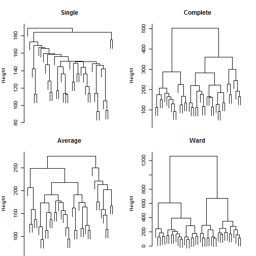 


Now pull out 10 clusters from the Ward data:

```r
par(op)
op <- par(mar = c(1, 4, 4, 1))
plot(pr.hc.w, labels = prDes$grp, cex = 0.6, main = "Ward showing 10 clusters")
rect.hclust(pr.hc.w, k = 10)
```

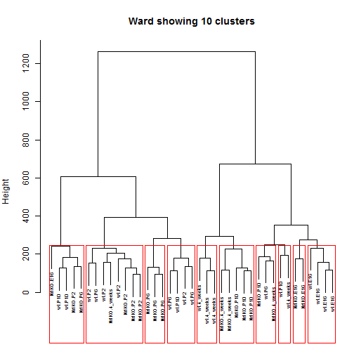 


Try the same with the average data:

```r
par(op)
op <- par(mar = c(1, 4, 4, 1))
plot(pr.hc.a, labels = prDes$grp, cex = 0.6, main = "Average showing 10 clusters")
rect.hclust(pr.hc.a, k = 10)
```

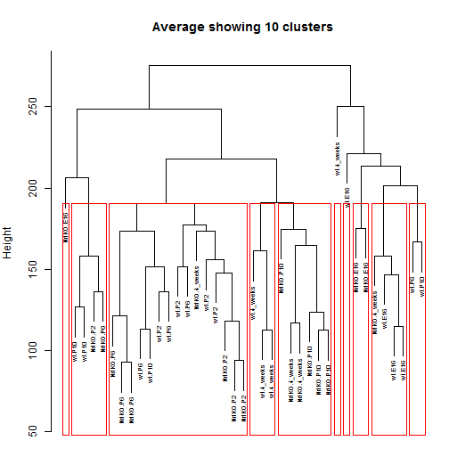 


Now try coming up with some heatmaps using different sample clustering methods. First, use Euclidean distance and average clustering:

```r
colFun <- colorRampPalette(brewer.pal(n = 9, "Greys"))
gTypeCols <- brewer.pal(11, "RdGy")[c(4, 7)]
heatmap(as.matrix(sprDat), Rowv = NA, col = colFun(256), hclustfun = function(x) hclust(x, 
    method = "average"), scale = "none", labCol = prDes$grp, labRow = NA, margins = c(8, 
    1), main = "Average", ColSideColor = gTypeCols[as.numeric(prDes$gType)])
legend("right", legend = levels(prDes$gType), col = gTypeCols, lty = 1, lwd = 5, 
    cex = 0.5)
```

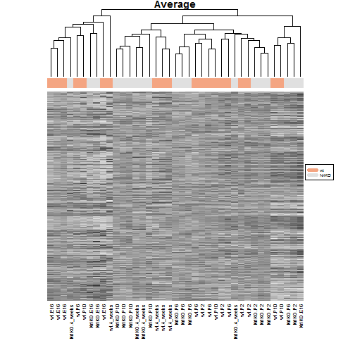 


Now try with centroid-based clustering:

```r
heatmap(as.matrix(sprDat), Rowv = NA, col = colFun(256), hclustfun = function(x) hclust(x, 
    method = "centroid"), scale = "none", labCol = prDes$grp, labRow = NA, margins = c(8, 
    1), main = "Centroid", ColSideColor = gTypeCols[as.numeric(prDes$gType)])
legend("right", legend = levels(prDes$gType), col = gTypeCols, lty = 1, lwd = 5, 
    cex = 0.5)
```

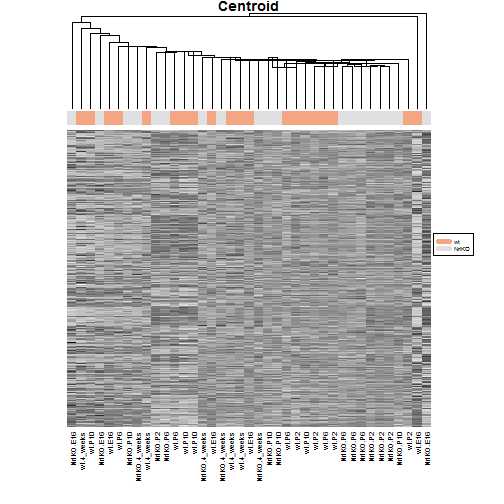 


Wow, this clustering looks really terrible!

### K-means clustering
Perform k-means clustering using initial k-value of 5:

```r
set.seed(540)
k <- 5
pr.km <- kmeans(t(sprDat), centers = k, nstart = 50)
```


Now take a look at the 5 clusters:

```r
pr.km$withinss
```

```
## [1] 133036 110209  78227 120153 100197
```

```r
pr.kmTable <- data.frame(devStage = prDes$devStage, cluster = pr.km$cluster)
prTable <- xtable(with(pr.kmTable, table(devStage, cluster)), caption = "Number of samples from each develomental stage within each k-means cluster")
align(prTable) <- "lccccc"
```


```r
print(prTable, type = "html", caption.placement = "top")
```

<!-- html table generated in R 3.0.2 by xtable 1.7-3 package -->
<!-- Tue Apr 15 08:13:21 2014 -->
<TABLE border=1>
<CAPTION ALIGN="top"> Number of samples from each develomental stage within each k-means cluster </CAPTION>
<TR> <TH>  </TH> <TH> 1 </TH> <TH> 2 </TH> <TH> 3 </TH> <TH> 4 </TH> <TH> 5 </TH>  </TR>
  <TR> <TD> E16 </TD> <TD align="center">   1 </TD> <TD align="center">   6 </TD> <TD align="center">   0 </TD> <TD align="center">   0 </TD> <TD align="center">   0 </TD> </TR>
  <TR> <TD> P2 </TD> <TD align="center">   4 </TD> <TD align="center">   0 </TD> <TD align="center">   0 </TD> <TD align="center">   4 </TD> <TD align="center">   0 </TD> </TR>
  <TR> <TD> P6 </TD> <TD align="center">   2 </TD> <TD align="center">   0 </TD> <TD align="center">   1 </TD> <TD align="center">   5 </TD> <TD align="center">   0 </TD> </TR>
  <TR> <TD> P10 </TD> <TD align="center">   2 </TD> <TD align="center">   0 </TD> <TD align="center">   2 </TD> <TD align="center">   1 </TD> <TD align="center">   3 </TD> </TR>
  <TR> <TD> 4_weeks </TD> <TD align="center">   0 </TD> <TD align="center">   1 </TD> <TD align="center">   2 </TD> <TD align="center">   0 </TD> <TD align="center">   5 </TD> </TR>
   </TABLE>


Try with a different seed:

```r
set.seed(54045)
k <- 5
pr.km <- kmeans(t(sprDat), centers = k, nstart = 50)
pr.km$withinss
```

```
## [1] 100197 110209 133036  78227 120153
```

```r
pr.kmTable <- data.frame(devStage = prDes$devStage, cluster = pr.km$cluster)
prTable <- xtable(with(pr.kmTable, table(devStage, cluster)), caption = "Number of samples from each develomental stage within each k-means cluster")
align(prTable) <- "lccccc"
```


```r
print(prTable, type = "html", caption.placement = "top")
```

<!-- html table generated in R 3.0.2 by xtable 1.7-3 package -->
<!-- Tue Apr 15 08:13:43 2014 -->
<TABLE border=1>
<CAPTION ALIGN="top"> Number of samples from each develomental stage within each k-means cluster </CAPTION>
<TR> <TH>  </TH> <TH> 1 </TH> <TH> 2 </TH> <TH> 3 </TH> <TH> 4 </TH> <TH> 5 </TH>  </TR>
  <TR> <TD> E16 </TD> <TD align="center">   0 </TD> <TD align="center">   6 </TD> <TD align="center">   1 </TD> <TD align="center">   0 </TD> <TD align="center">   0 </TD> </TR>
  <TR> <TD> P2 </TD> <TD align="center">   0 </TD> <TD align="center">   0 </TD> <TD align="center">   4 </TD> <TD align="center">   0 </TD> <TD align="center">   4 </TD> </TR>
  <TR> <TD> P6 </TD> <TD align="center">   0 </TD> <TD align="center">   0 </TD> <TD align="center">   2 </TD> <TD align="center">   1 </TD> <TD align="center">   5 </TD> </TR>
  <TR> <TD> P10 </TD> <TD align="center">   3 </TD> <TD align="center">   0 </TD> <TD align="center">   2 </TD> <TD align="center">   2 </TD> <TD align="center">   1 </TD> </TR>
  <TR> <TD> 4_weeks </TD> <TD align="center">   5 </TD> <TD align="center">   1 </TD> <TD align="center">   0 </TD> <TD align="center">   2 </TD> <TD align="center">   0 </TD> </TR>
   </TABLE>


Looks like we are getting the same clusters (just a different order), which reassures us that the k-means clustering is doing a good job.

### PAM algorithm
Now try the PAM algorithm, which uses a k-medoids based approach for clustering:

```r
pr.pam <- pam(pr.dis, k = k)
pr.pamTable <- data.frame(devStage = prDes$devStage, cluster = pr.pam$clustering)
pamTable <- xtable(with(pr.pamTable, table(devStage, cluster)), caption = "Number of samples from each develomental stage within each PAM cluster")
align(pamTable) <- "lccccc"
```


```r
print(pamTable, type = "html", caption.placement = "top")
```

<!-- html table generated in R 3.0.2 by xtable 1.7-3 package -->
<!-- Tue Apr 15 08:13:43 2014 -->
<TABLE border=1>
<CAPTION ALIGN="top"> Number of samples from each develomental stage within each PAM cluster </CAPTION>
<TR> <TH>  </TH> <TH> 1 </TH> <TH> 2 </TH> <TH> 3 </TH> <TH> 4 </TH> <TH> 5 </TH>  </TR>
  <TR> <TD> E16 </TD> <TD align="center">   6 </TD> <TD align="center">   1 </TD> <TD align="center">   0 </TD> <TD align="center">   0 </TD> <TD align="center">   0 </TD> </TR>
  <TR> <TD> P2 </TD> <TD align="center">   0 </TD> <TD align="center">   1 </TD> <TD align="center">   7 </TD> <TD align="center">   0 </TD> <TD align="center">   0 </TD> </TR>
  <TR> <TD> P6 </TD> <TD align="center">   3 </TD> <TD align="center">   2 </TD> <TD align="center">   3 </TD> <TD align="center">   0 </TD> <TD align="center">   0 </TD> </TR>
  <TR> <TD> P10 </TD> <TD align="center">   0 </TD> <TD align="center">   2 </TD> <TD align="center">   1 </TD> <TD align="center">   1 </TD> <TD align="center">   4 </TD> </TR>
  <TR> <TD> 4_weeks </TD> <TD align="center">   1 </TD> <TD align="center">   0 </TD> <TD align="center">   1 </TD> <TD align="center">   4 </TD> <TD align="center">   2 </TD> </TR>
   </TABLE>


Plot the silhouette values in order to determine how tight the clusters are:

```r
op <- par(mar = c(5, 1, 4, 4))
plot(pr.pam, main = "Silhouette Plot for 5 clusters")
```

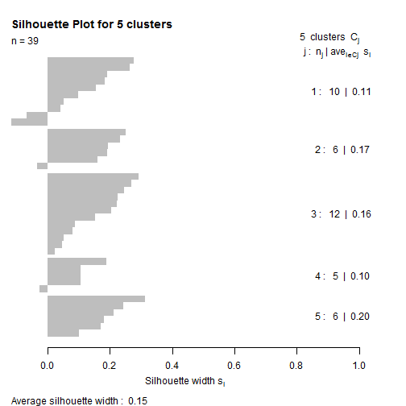 


Try some other values of k and compare their average silhouette values:

```r
sil.vals <- data.frame(k = c(2:10), sil.avg.width = rep(0, 9))
for (my.k in 2:10) {
    pr.pam <- pam(pr.dis, k = my.k)
    sil.vals[which(sil.vals$k == my.k), "sil.avg.width"] <- pr.pam$silinfo$avg.width
}
xyplot(sil.avg.width ~ k, sil.vals, ylab = "Average silhouette width", pch = 19, 
    cex = 1.5, col = "darkgrey")
```

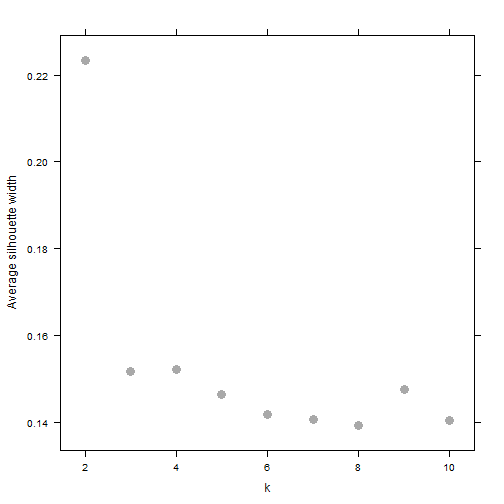 


Since the lowest value occurs at k = 8, it looks like 8 is the optimal cluster size for this data set.

Now using our previous results, compare the outcomes from the different clustering methods (with k = 8).

```r
set.seed(540)
pr.hc <- hclust(pr.dis)
hc.clust <- cutree(pr.hc, k = 8)
kmeans.clust <- kmeans(t(sprDat), centers = 8, nstart = 50)
pam.clust <- pam(pr.dis, k = 8)

all.clust <- data.frame(prDes, hc = hc.clust, kmeans = kmeans.clust$cluster, 
    pam = pam.clust$clustering)
stripplot(hc + kmeans + pam ~ sidNum, all.clust, outer = TRUE, pch = 19, auto.key = TRUE, 
    col = "black", layout = c(3, 1))
```

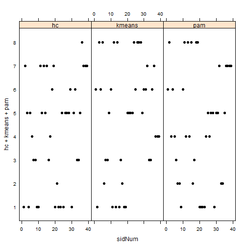 


Although the clusters have different orders, we can still see there is a large amount of concordance between clustering methods. Many of the same samples end up in similar groupings regardless of the method.

Gene clustering
---------------
We now narrow down our analysis to a subset of the genes. Using limma, get a list of the genes that show differential expression with respect to developmental stage:

```r
desMat <- model.matrix(~devStage, prDes)
fit <- lmFit(prDat, desMat)
ebFit <- eBayes(fit)
tt.res <- topTable(ebFit, coef = grep("devStage", colnames(coef(ebFit))), n = Inf, 
    p.value = 1e-05)
sDat <- sprDat[rownames(tt.res), ]
dim(sDat)
```

```
## [1] 972  39
```


Now get the Euclidean distance matrix for this subset:

```r
s.dis <- dist(sDat, method = "euclidean")
```


### Hierarchical clustering

```r
s.hc.a <- hclust(s.dis, method = "average")
plot(s.hc.a, labels = FALSE, main = "Hierarchical with Average Linkage", xlab = "")
```

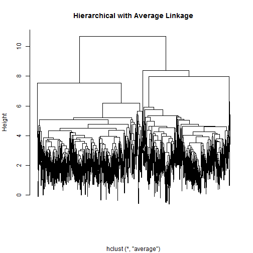 


Visualize the clusters for genes (& samples) using a heatmap:

```r
devStageCols <- brewer.pal(11, "RdGy")[c(2, 4, 7, 9, 11)]
heatmap(as.matrix(sDat), col = colFun(256), hclustfun = function(x) hclust(x, 
    method = "average"), labCol = prDes$grp, labRow = NA, margin = c(8, 1), 
    scale = "none", ColSideColor = devStageCols[unclass(prDes$devStage)])
legend("right", levels(prDes$devStage), col = devStageCols, lty = 1, lwd = 5, 
    cex = 0.5)
```

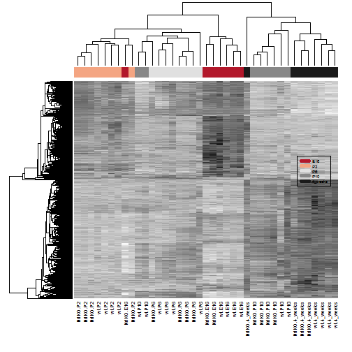 


### Evaluating clusters
Run a bootstrap analysis to assess confidence in the clusters:

```r
set.seed(540)
pvc <- pvclust(sDat, nboot = 100)
```

```
## Bootstrap (r = 0.5)... Done.
## Bootstrap (r = 0.6)... Done.
## Bootstrap (r = 0.7)... Done.
## Bootstrap (r = 0.8)... Done.
## Bootstrap (r = 0.9)... Done.
## Bootstrap (r = 1.0)... Done.
## Bootstrap (r = 1.1)... Done.
## Bootstrap (r = 1.2)... Done.
## Bootstrap (r = 1.3)... Done.
## Bootstrap (r = 1.4)... Done.
```

```r
plot(pvc, labels = prDes$grp, cex = 0.6)
pvrect(pvc, alpha = 0.95)
```

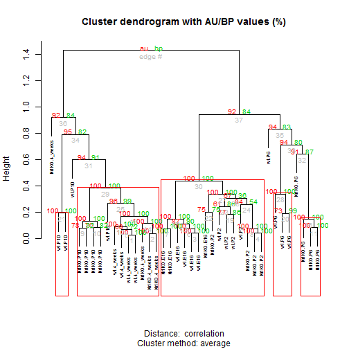 


Run it again to see if the number of confident clusters changes:

```r
set.seed(54045)
pvc <- pvclust(sDat, nboot = 100)
```

```
## Bootstrap (r = 0.5)... Done.
## Bootstrap (r = 0.6)... Done.
## Bootstrap (r = 0.7)... Done.
## Bootstrap (r = 0.8)... Done.
## Bootstrap (r = 0.9)... Done.
## Bootstrap (r = 1.0)... Done.
## Bootstrap (r = 1.1)... Done.
## Bootstrap (r = 1.2)... Done.
## Bootstrap (r = 1.3)... Done.
## Bootstrap (r = 1.4)... Done.
```

```r
plot(pvc, labels = prDes$grp, cex = 0.6)
pvrect(pvc, alpha = 0.95)
```

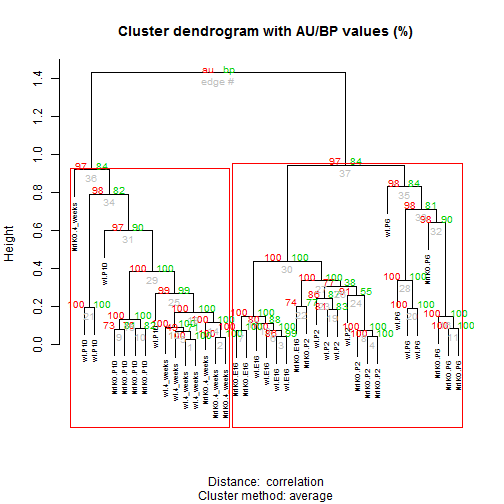 


Seems to be changing, maybe indicating that the method isn't the best.

### Principal components analysis
Calculate the principal components for the whole data set:

```r
pcs <- prcomp(sprDat, center = F, scale = F)
plot(pcs)
```

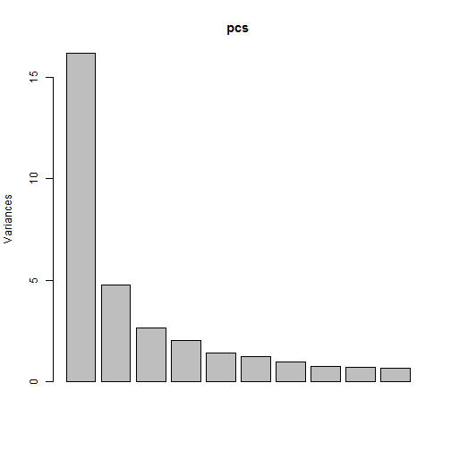 


Observe how metadata relates to the PCs:

```r
prinComp <- cbind(prDes, pcs$rotation[, 1:10])
plot(prinComp[, c("sidNum", "devStage", "gType", "PC1", "PC2", "PC3")], pch = 19, 
    cex = 0.8)
```

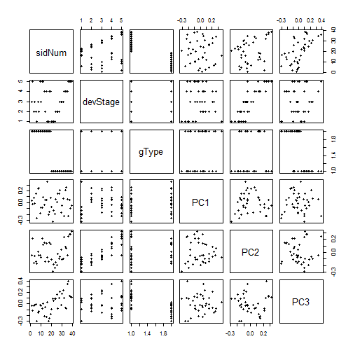 


Cool! Looks like PC2 might be related to developmental stage, and PC3 may be related to genotype.

Do the first two components separate the data by developmental stage?

```r
colFun <- colorRampPalette(brewer.pal(n = 5, "Set1"))
myCols <- colFun(5)
xyplot(PC2 ~ PC1, prinComp, group = devStage, pch = 19, cex = 1.5, col = myCols, 
    key = list(space = "right", points = list(col = myCols, pch = 19, cex = 1.5), 
        text = list(levels(prinComp$devStage))))
```

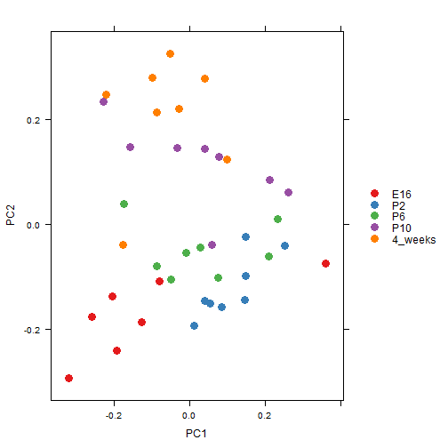 


It looks like they sort of cluster by stage! This is more visible on the y-axis (PC2), which makes sense with the results we saw in our plot matrix.
